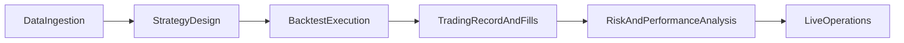

# Canonical User Journey

This page is the canonical end-to-end path for production-minded Java developers:

`data -> strategy -> execution -> record -> analysis -> live operations`

If you follow only one path through the ta4j docs, follow this one.

## Journey map

## Step 1: Data ingestion and bar modeling

Goal: build a deterministic `BarSeries` that matches your intended market and timeframe semantics.

Start with:

- [Getting Started](Getting-started.md)
- [Data Sources](Data-Sources.md)
- [Bar Series and Bars](Bar-series-and-bars.md)

Use examples:

- `ta4jexamples.Quickstart`
- `ta4jexamples.backtesting.YahooFinanceBacktest`
- `ta4jexamples.backtesting.CoinbaseBacktest`

Exit criteria:

- You can reproduce the same bars for the same input range.
- You have clear timezone, interval, and gap-handling conventions.

## Step 2: Strategy design and rule composition

Goal: build explicit entry, exit, and risk-gating logic with predictable semantics.

Read:

- [Trading Strategies](Trading-strategies.md)
- [Technical Indicators](Technical-indicators.md)
- [Indicators Inventory](Indicators-Inventory.md)
- [Stop Loss and Stop Gain Rules](Stop-Loss-and-Stop-Gain-Rules.md)

Use examples:

- `ta4jexamples.strategies.RSI2Strategy`
- `ta4jexamples.strategies.ADXStrategy`
- `ta4jexamples.strategies.NetMomentumStrategy`

Exit criteria:

- Strategy logic is expressed in reusable rules.
- Warmup (`setUnstableBars`) is explicitly configured.

## Step 3: Backtest execution and realism

Goal: run realistic backtests with explicit execution assumptions and reproducible comparisons.

Read:

- [Backtesting](Backtesting.md)
- [Walk-Forward Research](Walk-Forward-Research.md)

Use examples:

- `ta4jexamples.backtesting.TradingRecordParityBacktest`
- `ta4jexamples.backtesting.SimpleMovingAverageRangeBacktest`
- `ta4jexamples.backtesting.BacktestPerformanceTuningHarness`

Exit criteria:

- Execution model and cost assumptions are documented.
- Ranking method (single criterion vs weighted) is intentional.
- Walk-forward or holdout validation exists for promoted strategies.

## Step 4: Trading record and fill semantics

Goal: treat broker-confirmed fills as the source of truth while keeping strategy evaluation deterministic.

Read:

- [Live Trading](Live-trading.md)
- [Backtesting](Backtesting.md) (manual/fill-driven sections)

Use examples:

- `ta4jexamples.backtesting.TradeFillRecordingExample`
- `ta4jexamples.bots.TradingBotOnMovingBarSeries`

Exit criteria:

- You separate signal decisions from fill recording.
- You can explain lot matching policy (`FIFO`, `LIFO`, `AVG_COST`, `SPECIFIC_ID`).

## Step 5: Risk and performance analysis

Goal: evaluate outcomes with criteria aligned to business objectives, not one metric in isolation.

Read:

- [Analysis Criteria and Risk Metrics](Analysis-Criteria-and-Risk-Metrics.md)
- [Num](Num.md)

Use examples:

- `ta4jexamples.analysis.StrategyAnalysis`
- `ta4jexamples.analysis.TradeCost`

Exit criteria:

- You track return, drawdown, and at least one risk-adjusted measure.
- You understand the `Num` precision/performance tradeoff for your workload.

## Step 6: Live operations and recovery

Goal: run safely in production with explicit operational safeguards and recovery practices.

Read:

- [Live Trading Runbook](Live-Trading-Runbook.md)
- [Troubleshooting Hub](Troubleshooting-Hub.md)

Use examples:

- `ta4jexamples.bots.TradingBotOnMovingBarSeries`
- `ta4jexamples.backtesting.TradeFillRecordingExample`

Exit criteria:

- Startup/restart/reconciliation procedures are documented.
- You have monitoring for ingestion gaps, stale signals, and order failures.

## Related references

- [Usage Examples](Usage-examples.md)
- [Charting](Charting.md)
- [Execution Decision Matrix](Execution-Decision-Matrix.md)
- [Migration and Version Compatibility](Migration-and-Version-Compatibility.md)
- [Examples Expected Outputs](Examples-Expected-Outputs.md)
- [Performance Characterization](Performance-Characterization.md)
- [Documentation Quality Rubric](Documentation-Quality-Rubric.md)
