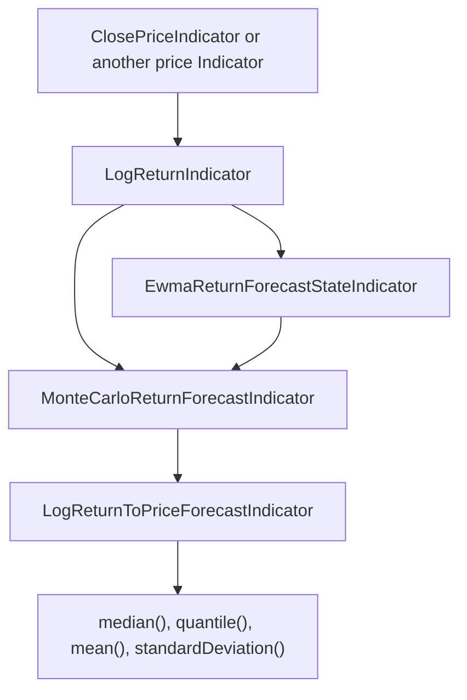

# Forecast Indicators

Forecast indicators estimate a future distribution from data available at a decision index. They are useful when a strategy needs a probabilistic price or return outlook instead of a single backward-looking technical signal.

The forecast API lives mostly in `org.ta4j.core.indicators.forecast`. `LogReturnIndicator` is a normal helper indicator in `org.ta4j.core.indicators.helpers` and can be used outside forecasting pipelines.

## When to use them

Use forecast indicators when you want to answer questions such as:

- What is the median expected close price five bars from now?
- What are the 5th and 95th percentile price outcomes for the next session?
- Is the forecast distribution wide enough that a signal should be ignored?
- How does a signal perform when evaluated against a fixed future horizon?

Do not treat a forecast as a guaranteed target. A forecast distribution is an input to risk management, strategy rules, sizing, and research. It should still be validated with realistic execution assumptions and out-of-sample tests.

## Quick Start: Price Forecast Distribution

This example builds the standard EWMA-volatility Monte Carlo pipeline and returns forecast prices, not returns.

```java
import org.ta4j.core.BarSeries;
import org.ta4j.core.Indicator;
import org.ta4j.core.indicators.forecast.DriftMode;
import org.ta4j.core.indicators.forecast.EwmaReturnForecastStateConfig;
import org.ta4j.core.indicators.forecast.ForecastDistributionIndicator;
import org.ta4j.core.indicators.forecast.ForecastIndicators;
import org.ta4j.core.indicators.forecast.MonteCarloForecastConfig;
import org.ta4j.core.indicators.forecast.ShockModel;
import org.ta4j.core.indicators.forecast.VolatilityUpdateMode;
import org.ta4j.core.indicators.helpers.ClosePriceIndicator;
import org.ta4j.core.num.Num;

BarSeries series = ...;
ClosePriceIndicator close = new ClosePriceIndicator(series);

EwmaReturnForecastStateConfig stateConfig = EwmaReturnForecastStateConfig.builder()
        .initializationBarCount(30)
        .decayFactor(0.94)
        .driftMode(DriftMode.ZERO)
        .build();

MonteCarloForecastConfig forecastConfig = MonteCarloForecastConfig.builder()
        .horizon(5)
        .iterationCount(2_000)
        .lookbackBarCount(252)
        .seed(42L)
        .shockModel(ShockModel.STANDARDIZED_EMPIRICAL)
        .volatilityUpdateMode(VolatilityUpdateMode.CONSTANT)
        .quantiles(0.05, 0.5, 0.95)
        .build();

ForecastDistributionIndicator priceForecast =
        ForecastIndicators.ewmaVolatilityClosePriceForecast(close, stateConfig, forecastConfig);

Indicator<Num> downsideForecast = priceForecast.quantile(0.05);
Indicator<Num> medianForecast = priceForecast.median();
Indicator<Num> upsideForecast = priceForecast.quantile(0.95);

int index = series.getEndIndex();
Num downside = downsideForecast.getValue(index);
Num median = medianForecast.getValue(index);
Num upside = upsideForecast.getValue(index);
```

Use `ForecastDistributionIndicator` projection methods for strategy rules, chart overlays, and other ta4j data flows. Each projection shifts the index lookup onto a normal `Indicator<Num>` and returns `NaN` while the source distribution is unstable.

The raw `ForecastDistribution<Num>` snapshot remains useful for diagnostics and metadata. At each index, it contains:

- `index()`: the decision index where the forecast was made.
- `horizon()`: the configured number of bars ahead.
- `sampleCount()`: the number of simulated samples summarized.
- `isStable()`: whether the forecast is usable at this decision index.
- `mean()`, `median()`, `standardDeviation()`: summary values.
- `quantiles()`: configured quantile probabilities to values.
- `quantile(probability)`: one configured quantile value.

Only request quantile projections that were configured in `MonteCarloForecastConfig`. For example, `priceForecast.quantile(0.05)` returns useful values only if `0.05` was included in `quantiles(...)`.

## Point Projection Indicators

Many rules and indicators need one `Num` value per index. `ForecastDistributionIndicator` exposes projection methods that return normal `Indicator<Num>` instances.

```java
import org.ta4j.core.Indicator;
import org.ta4j.core.num.Num;
import org.ta4j.core.rules.OverIndicatorRule;
import org.ta4j.core.Rule;

Indicator<Num> medianForecast = priceForecast.median();
Indicator<Num> downsideForecast = priceForecast.quantile(0.05);
Indicator<Num> forecastWidth = priceForecast.standardDeviation();

Rule forecastAboveCurrentPrice = new OverIndicatorRule(medianForecast, close);
```

There is also a convenience factory for the common median close-price case:

```java
Indicator<Num> medianPriceForecast =
        ForecastIndicators.ewmaVolatilityMedianClosePriceForecast(close, stateConfig, forecastConfig);
```

Projection indicators return `NaN` when the source distribution is unstable or when the requested quantile is missing. That makes projected forecasts safe to compose with normal ta4j rules and indicators, including `UnaryOperationIndicator` and `BinaryOperationIndicator`.

## Manual Pipeline

The convenience factory builds this pipeline:



Use the manual pipeline when you need direct access to return forecasts, a custom price source, custom point projections, or intermediate state diagnostics.

```java
import org.ta4j.core.indicators.forecast.EwmaReturnForecastStateIndicator;
import org.ta4j.core.indicators.forecast.ForecastDistributionIndicator;
import org.ta4j.core.indicators.forecast.LogReturnToPriceForecastIndicator;
import org.ta4j.core.indicators.forecast.MonteCarloReturnForecastIndicator;
import org.ta4j.core.indicators.helpers.LogReturnIndicator;
import org.ta4j.core.num.Num;

LogReturnIndicator returns = new LogReturnIndicator(close);
EwmaReturnForecastStateIndicator state =
        new EwmaReturnForecastStateIndicator(returns, stateConfig);

ForecastDistributionIndicator returnForecast =
        new MonteCarloReturnForecastIndicator(returns, state, forecastConfig);

ForecastDistributionIndicator priceForecast =
        new LogReturnToPriceForecastIndicator(close, returnForecast);
```

`MonteCarloReturnForecastIndicator` produces a cumulative log-return distribution over the configured horizon. `LogReturnToPriceForecastIndicator` converts it to a price distribution with:

```text
forecastPrice = priceAtDecisionIndex * exp(cumulativeLogReturn)
```

## Configuration Guide

### EWMA State

`EwmaReturnForecastStateIndicator` estimates rolling return state from a log-return source.

| Setting | Default | Meaning | Common tuning |
| --- | --- | --- | --- |
| `initializationBarCount` | `30` | Number of valid return observations required before state is stable. | Increase for slower, steadier estimates; decrease for faster adaptation. |
| `decayFactor` | `0.94` | EWMA persistence in `(0, 1)`. Higher values react more slowly. | Use higher values for daily data and lower values for shorter bars only after validation. |
| `driftMode` | `DriftMode.ZERO` | Drift used in simulated paths. | Prefer `ZERO` as a conservative default; use `ROLLING_MEAN` only when the rolling mean has validated predictive value. |

The state output is a `ReturnForecastState` with rolling `mean`, forecast `drift`, `variance`, and `volatility`.

### Monte Carlo Forecast

`MonteCarloForecastConfig` controls horizon, samples, shock model, and returned quantiles.

| Setting | Default | Meaning | Common tuning |
| --- | --- | --- | --- |
| `horizon` | `1` | Number of bars ahead to forecast. | Match the holding period or evaluation label. |
| `iterationCount` | `1_000` | Number of simulated paths. | Increase for smoother quantiles; reduce only for latency-sensitive live loops after measuring. |
| `lookbackBarCount` | `252` | Number of historical returns used for empirical shocks. | Match the market regime window you want represented. |
| `seed` | `42L` | Base random seed. | Keep fixed for reproducible research and tests. |
| `shockModel` | `STANDARDIZED_EMPIRICAL` | Source of simulated return shocks. | See the shock model table below. |
| `volatilityUpdateMode` | `CONSTANT` | Volatility behavior inside each simulated path. | Use `EWMA` only when path-dependent volatility is part of the model assumption. |
| `volatilityDecayFactor` | `0.94` | EWMA decay used when volatility updates are enabled. | Usually match the state decay factor. |
| `quantiles` | `0.05, 0.25, 0.5, 0.75, 0.95` | Distribution percentiles to include. | Configure only the percentiles your strategy or report consumes. |

### Shock Models

| Shock model | Behavior | Use when |
| --- | --- | --- |
| `HISTORICAL_BOOTSTRAP` | Samples raw historical returns from the lookback window. | You want the recent empirical return distribution without rescaling by current volatility. |
| `STANDARDIZED_EMPIRICAL` | Samples standardized residuals and scales them by the current EWMA state. | You want empirical tail shape with current volatility and drift. This is the default. |
| `NORMAL` | Draws standard normal shocks and scales them by the current EWMA state. | You want a simple parametric baseline and accept thinner tails than many markets show. |

### Volatility Update Modes

| Mode | Behavior | Tradeoff |
| --- | --- | --- |
| `CONSTANT` | Uses the decision-index volatility for every simulated step in a path. | Simple, reproducible, and usually the first model to validate. |
| `EWMA` | Updates path volatility after each simulated step using `volatilityDecayFactor`. | More dynamic, but adds another assumption that must be tested. |

## Warm-Up and Unstable Values

Forecast indicators deliberately return unstable distributions until enough valid data is available.

Important warm-up rules:

- `LogReturnIndicator` is unstable for `source.getCountOfUnstableBars() + barCount` bars.
- `EwmaReturnForecastStateIndicator` is unstable for `returnIndicator.getCountOfUnstableBars() + initializationBarCount - 1` bars.
- `MonteCarloReturnForecastIndicator` is unstable until both the state is stable and the configured return lookback is available.
- With the default one-bar log return and default `lookbackBarCount(252)`, the standard Monte Carlo return forecast first becomes eligible at index `252` when all returns are valid.

Unstable values can also occur after warm-up when:

- A source price is zero, negative, `NaN`, or infinite.
- A return in the required initialization window is invalid.
- The historical lookback does not contain enough valid returns.
- A price forecast cannot be converted because the decision-index price is invalid or non-positive.

Prefer projection indicators for rule and indicator composition. If you intentionally inspect raw `ForecastDistribution` snapshots in reporting or diagnostics, check `isStable()` before reading summary values. Projection indicators return `NaN` for unstable distributions, which normal ta4j rules will treat as not satisfying comparisons.

## Avoiding Look-Ahead Bias

Forecast indicators are designed to produce `getValue(i)` using only source data available at or before index `i`. The forecast horizon describes what the distribution is about; it does not allow the indicator to read future bars.

For research:

- Generate the forecast at decision index `i`.
- Compare it later with the realized value at `i + horizon`.
- Do not feed realized future returns back into the strategy rule at `i`.
- Match `horizon` to the execution and holding-period assumption you are testing.

For live trading:

- Evaluate the forecast only after the decision bar contains the data your execution model assumes.
- Prefer next-open or broker-confirmed execution unless your system truly can act on the current close.
- Keep the moving `BarSeries` large enough to retain the return lookback plus warm-up margin.

## Practical Strategy Patterns

### Median Direction Filter

Use the median point forecast as a directional filter:

```java
Indicator<Num> medianForecast =
        ForecastIndicators.ewmaVolatilityMedianClosePriceForecast(close, stateConfig, forecastConfig);

Rule bullishForecast = new OverIndicatorRule(medianForecast, close);
```

This is intentionally minimal. In real strategies, add costs, slippage, and a required edge threshold so tiny forecast differences do not trigger trades.

### Downside Risk Filter

Use a low quantile to avoid entries when the downside tail is too close.

```java
Indicator<Num> fifthPercentilePrice =
        priceForecast.quantile(0.05);

Rule downsideAboveStop = new OverIndicatorRule(fifthPercentilePrice, plannedStopPrice);
```

`plannedStopPrice` can be any `Indicator<Num>` on the same series, such as an ATR stop, support indicator, or fixed threshold indicator.

### Distribution Width Filter

Use `priceForecast.standardDeviation()` when you want to avoid forecasts that are too uncertain, or require enough spread for a volatility strategy. The result is in the same unit as the distribution: log-return units for return forecasts and price units for price forecasts.

## Choosing Return or Price Space

Use return forecasts when:

- You are comparing forecasts across instruments with different price levels.
- You want cumulative log-return quantiles for research labels.
- You are building position sizing or risk logic in return space.

Use price forecasts when:

- Strategy rules compare the forecast to current price, stops, targets, support, resistance, or chart overlays.
- You want report output in user-facing price units.

`LogReturnToPriceForecastIndicator` is the bridge between the two.

## Reproducibility Notes

The Monte Carlo indicator mixes the configured seed with the decision index and horizon. That means the same seed, index, horizon, inputs, and configuration produce the same distribution independent of call order. This is important for cached indicators, tests, and chart rendering.

Do not rely on a seed to make an invalid forecast stable. Reproducibility only applies once the data and warm-up requirements are satisfied.

## Common Problems

| Symptom | Likely cause | Fix |
| --- | --- | --- |
| Projection values are `NaN` early in the series. | Warm-up and lookback requirements are not met. | Start reading after `forecast.getCountOfUnstableBars()`. |
| Quantile projection is `NaN` at a stable index. | The probability was not included in `quantiles(...)`. | Add that exact probability to `MonteCarloForecastConfig`. |
| Point forecast is `NaN`. | The source distribution is unstable, the projection requested a missing quantile, or source data is invalid. | Check warm-up, configured quantiles, and source price/return validity. |
| Price forecast is unstable while return forecast is stable. | Decision-index price is non-positive or invalid. | Check the source price indicator and data feed. |
| Live forecasts disappear with a moving series. | The series evicted bars required by the lookback. | Increase `setMaximumBarCount` or reduce lookback after validation. |

## API Map

| Type | Package | Purpose |
| --- | --- | --- |
| `LogReturnIndicator` | `org.ta4j.core.indicators.helpers` | Normal numeric helper indicator for `log(x[i] / x[i - n])`. |
| `EwmaReturnForecastStateConfig` | `org.ta4j.core.indicators.forecast` | EWMA state configuration. |
| `EwmaReturnForecastStateIndicator` | `org.ta4j.core.indicators.forecast` | Rolling return mean, drift, variance, and volatility estimator. |
| `ReturnForecastState` | `org.ta4j.core.indicators.forecast` | State record produced by the EWMA estimator. |
| `MonteCarloForecastConfig` | `org.ta4j.core.indicators.forecast` | Monte Carlo horizon, iteration, seed, shock, volatility, and quantile settings. |
| `MonteCarloReturnForecastIndicator` | `org.ta4j.core.indicators.forecast` | Cumulative log-return forecast distribution indicator. |
| `ForecastDistribution` | `org.ta4j.core.indicators.forecast` | Immutable distribution summary record. |
| `ForecastDistributionIndicator` | `org.ta4j.core.indicators.forecast` | Indicator interface for distribution-valued forecasts with point projection methods. |
| `LogReturnToPriceForecastIndicator` | `org.ta4j.core.indicators.forecast` | Converts cumulative log-return distributions to price distributions. |
| `ForwardForecastIndicator` | `org.ta4j.core.indicators.forecast` | Adapter used by point projection methods to expose one `Num` forecast. |
| `ForecastIndicators` | `org.ta4j.core.indicators.forecast` | Convenience factories for standard forecast pipelines. |
