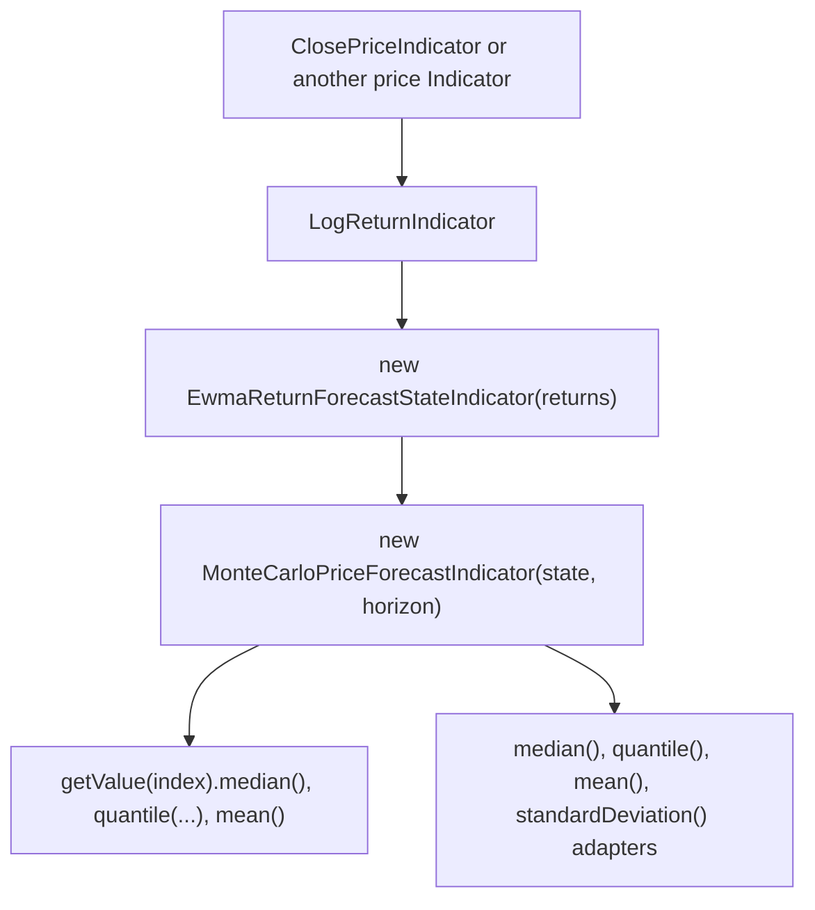

# Forecast Indicators

Forecast indicators estimate a future return or price distribution from data available at a decision index. They are useful when a strategy needs a probabilistic outlook instead of a single backward-looking technical signal.

The forecast API lives under `org.ta4j.core.indicators.forecast`. The root package contains the primary indicators most users instantiate, while state contracts, projection contracts, the `Forecast` value model, and conversion adapters live in `forecast.state`, `forecast.projection`, and `forecast.adapters`. `LogReturnIndicator` is a normal helper indicator in `org.ta4j.core.indicators.helpers`, and `EWMAIndicator` is a reusable average in `org.ta4j.core.indicators.averages`.

**Release status:** These APIs are introduced by the matching ta4j feature branch for CF-289 and should be published with ta4j 0.22.9 or newer. Until that ta4j change is merged and released, use this guide with the matching ta4j branch rather than the current release artifacts.

## When to use them

Use forecast indicators when you want to answer questions such as:

- What is the median expected close price five bars from now?
- What are the 5th and 95th percentile price outcomes for the next session?
- Is the forecast summary wide enough that a signal should be ignored?
- How does a signal perform when evaluated against a fixed future horizon?

Do not treat a forecast as a guaranteed target. A forecast is an input to risk management, strategy rules, sizing, and research. It should still be validated with realistic execution assumptions and out-of-sample tests.

## Quick Start: Price Forecast

This example builds an EWMA-volatility Monte Carlo pipeline and projects forecast prices, not returns.

```java
import org.ta4j.core.BarSeries;
import org.ta4j.core.Indicator;
import org.ta4j.core.indicators.forecast.EwmaReturnForecastStateIndicator;
import org.ta4j.core.indicators.forecast.MonteCarloPriceForecastIndicator;
import org.ta4j.core.indicators.forecast.projection.Forecast;
import org.ta4j.core.indicators.forecast.projection.ForecastProjectionIndicator;
import org.ta4j.core.indicators.forecast.state.ReturnForecastStateIndicator;
import org.ta4j.core.indicators.helpers.LogReturnIndicator;
import org.ta4j.core.num.Num;

BarSeries series = ...;
LogReturnIndicator returns = new LogReturnIndicator(series);
ReturnForecastStateIndicator state = new EwmaReturnForecastStateIndicator(returns);
ForecastProjectionIndicator priceForecast = new MonteCarloPriceForecastIndicator(state, 5);

int index = series.getEndIndex();
Forecast<Num> forecast = priceForecast.getValue(index);
if (forecast.isStable()) {
    Num directDownside = forecast.quantile(0.05);
    Num directMedian = forecast.median();
    Num directUpside = forecast.quantile(0.95);
}

// Equivalent convenience path: same values at the same index, easier to compose.
Indicator<Num> downsideForecast = priceForecast.quantile(0.05);
Indicator<Num> medianForecast = priceForecast.median();
Indicator<Num> upsideForecast = priceForecast.quantile(0.95);

Num helperDownside = downsideForecast.getValue(index);
Num helperMedian = medianForecast.getValue(index);
Num helperUpside = upsideForecast.getValue(index);
```

Direct `priceForecast.getValue(index)` access is the normal `Indicator` path when reporting or inspecting a full forecast summary. `ForecastProjectionIndicator` methods such as `median()` and `quantile(...)` are convenience adapters for strategy rules, chart overlays, and other ta4j data flows that need one `Indicator<Num>` value per index. Each projection returns `NaN` while the source forecast is unstable.

The setup has three business decisions:

- `LogReturnIndicator` declares the source stream as log returns through the `ReturnIndicator` semantic contract.
- `EwmaReturnForecastStateIndicator` provides hidden return state from that log-return stream.
- `MonteCarloPriceForecastIndicator` projects prices from that state and infers the source price indicator from `LogReturnIndicator`.

The default EWMA state uses a 30-bar initialization window, `0.94` decay, and zero drift. The default Monte Carlo projection uses standardized empirical shocks, 1,000 simulations, a 252-return lookback, and default quantiles of `0.05`, `0.25`, `0.5`, `0.75`, and `0.95`.

## Architecture

The forecasting layer is organized around three responsibilities:

- **Hidden state estimators** build latent state from source indicators. `EwmaReturnForecastStateIndicator` is the initial estimator; its reusable contracts and state record live in `org.ta4j.core.indicators.forecast.state`.
- **Projection indicators** turn hidden state into a forward `Forecast<Num>`. `MonteCarloReturnProjectionIndicator` projects cumulative log returns; `MonteCarloPriceForecastIndicator` is the constructor-first price forecast path for the common log-return workflow. Projection contracts, point adapters, and the forecast summary value model live in `org.ta4j.core.indicators.forecast.projection`.
- **Adapters and glue** bridge forecast domains or API shapes. `LogReturnToPriceForecastIndicator` lives in `org.ta4j.core.indicators.forecast.adapters` because it converts an explicit log-return projection into price space rather than estimating state or simulating paths itself.

The root `forecast` package intentionally stays focused on the primary indicators users choose and compose. Framework types, data records, and conversion bridges are grouped under subpackages so custom estimators and custom projection models have obvious extension points without turning the root package into a catch-all.

The raw `Forecast<Num>` summary remains useful for diagnostics and metadata. At each index, it contains:

- `decisionIndex()` / `index()`: the decision index where the forecast was made.
- `horizon()`: the configured number of bars ahead.
- `sampleCount()`: the number of simulated samples summarized.
- `isStable()`: whether the forecast is usable at this decision index.
- `mean()`, `median()`, `standardDeviation()`: summary values.
- `quantiles()`: configured quantile probabilities to values.
- `hasQuantile(probability)`: whether a valid quantile probability is available.
- `quantile(probability)`: one configured quantile value, or `null` when a valid probability was not configured.

In the CF-289/0.22.9 API, direct lookup and projection helpers handle missing quantiles differently. `priceForecast.getValue(index).quantile(0.90)` returns `null` when `0.90` was not configured, while `priceForecast.quantile(0.90).getValue(index)` returns `NaN` so the result composes safely as an `Indicator<Num>`. Invalid probabilities outside `[0, 1]` still throw.

## Point Projection Indicators

Direct `priceForecast.getValue(index)` access returns the full forecast summary. When rules and other indicators need one `Num` value per index, `ForecastProjectionIndicator` exposes convenience projection methods that adapt summary fields into normal `Indicator<Num>` instances.

```java
BarSeries series = ...;
LogReturnIndicator returns = new LogReturnIndicator(series);
ReturnForecastStateIndicator state = new EwmaReturnForecastStateIndicator(returns);
ForecastProjectionIndicator priceForecast = new MonteCarloPriceForecastIndicator(state, 5);
ClosePriceIndicator close = new ClosePriceIndicator(series);

// Adapter forms of priceForecast.getValue(index).median()/quantile(...).
Indicator<Num> medianForecast = priceForecast.median();
Indicator<Num> downsideForecast = priceForecast.quantile(0.05);
Indicator<Num> upsideForecast = priceForecast.quantile(0.95);
Indicator<Num> forecastWidth = BinaryOperationIndicator.difference(upsideForecast, downsideForecast);

Rule forecastAboveCurrentPrice = new OverIndicatorRule(medianForecast, close);
```

These helper indicators are equivalent to reading the same field from `priceForecast.getValue(index)` at the same index. They return `NaN` when the source forecast is unstable or when the requested quantile is missing. That makes projected forecasts safe to compose with normal ta4j rules and indicators, including `UnaryOperationIndicator` and `BinaryOperationIndicator`.

## Pipeline



Use this pipeline for normal strategy rules, chart overlays, and reports in price units. The API intentionally avoids a god factory so the return source, state model, and projection model remain reusable and testable.

Internally, `MonteCarloPriceForecastIndicator` produces a cumulative log-return forecast over the configured horizon and converts it to a price forecast with:

```text
forecastPrice = priceAtDecisionIndex * exp(cumulativeLogReturn)
```

## Configuration Guide

### EWMA State

`new EwmaReturnForecastStateIndicator(returns)` estimates rolling return state from a log-return source. Its constructors accept `ReturnIndicator`, not arbitrary `Indicator<Num>`, and reject return streams whose `ReturnRepresentation` is not `LOG`.

| Parameter | Default in examples | Meaning | Common tuning |
| --- | --- | --- | --- |
| `initializationBarCount` | `30` | Number of valid return observations required before state is stable. | Increase for slower, steadier estimates; decrease for faster adaptation. |
| `decayFactor` | `0.94` | EWMA persistence in `(0, 1)`. Higher values react more slowly. | Use higher values for daily data and lower values for shorter bars only after validation. |
| `driftMode` | `EwmaReturnForecastStateIndicator.DriftMode.ZERO` | Drift used in simulated paths. | Prefer `ZERO` as a conservative default; use `ROLLING_MEAN` only when the rolling mean has validated predictive value. |

The state output is a `ReturnForecastState` with rolling `mean`, forecast `drift`, `variance`, and `volatility`.

### Monte Carlo Forecast

`new MonteCarloPriceForecastIndicator(state, horizon)` is the standard constructor for EWMA Monte Carlo price forecasts. It accepts a `ReturnForecastStateIndicator`, validates that the state indicator is log-return based, and infers the source price indicator from the state's `LogReturnIndicator`. Use `MonteCarloReturnProjectionIndicator.builder(state)` only when you need to tune simulation settings beyond horizon or work directly in return space.

| Constructor or builder method | Default | Meaning | Common tuning |
| --- | --- | --- | --- |
| `new MonteCarloPriceForecastIndicator(state)` | `1` bar | Default one-bar price forecast from the supplied state indicator. | Use for next-bar forecasts. |
| `new MonteCarloPriceForecastIndicator(state, horizon)` | caller supplied | Number of bars ahead to forecast. | Match the holding period or evaluation label. |
| `iterationCount(...)` | `1_000` | Number of simulated paths. | Increase for smoother quantiles; reduce only for latency-sensitive live loops after measuring. |
| `lookbackBarCount(...)` | `252` | Number of historical returns used for empirical shocks. | Match the market regime window you want represented. |
| `seed(...)` | `42L` | Base random seed. | Keep fixed for reproducible research and tests. |
| `shockModel(...)` | `STANDARDIZED_EMPIRICAL` | Source of simulated return shocks. | See the shock model table below. |
| `volatilityUpdateMode(...)` | `CONSTANT` | Volatility behavior inside each simulated path. | Use `EWMA` only when path-dependent volatility is part of the model assumption. |
| `volatilityDecayFactor(...)` | `0.94` | EWMA decay used when volatility updates are enabled. | Usually match the state decay factor. |
| `quantiles(...)` | `0.05, 0.25, 0.5, 0.75, 0.95` | Forecast percentiles to include. | Configure only the percentiles your strategy or report consumes. |

The constructor-first `MonteCarloPriceForecastIndicator` uses the default quantile set. For custom price quantiles, build the tuned return projection and wrap it with the explicit price adapter:

```java
BarSeries series = ...;
LogReturnIndicator returns = new LogReturnIndicator(series);
ReturnForecastStateIndicator state = new EwmaReturnForecastStateIndicator(returns);
ClosePriceIndicator close = new ClosePriceIndicator(series);

MonteCarloReturnProjectionIndicator returnProjection =
        MonteCarloReturnProjectionIndicator.builder(state)
                .horizon(5)
                .quantiles(0.05, 0.5, 0.90, 0.95)
                .build();
ForecastProjectionIndicator priceForecast =
        new LogReturnToPriceForecastIndicator(close, returnProjection);
```

### Shock Models

| Shock model | Behavior | Use when |
| --- | --- | --- |
| `MonteCarloReturnProjectionIndicator.ShockModel.HISTORICAL_BOOTSTRAP` | Samples raw historical returns from the lookback window. | You want the recent empirical return distribution without rescaling by current volatility. |
| `MonteCarloReturnProjectionIndicator.ShockModel.STANDARDIZED_EMPIRICAL` | Samples standardized residuals and scales them by the current EWMA state. | You want empirical tail shape with current volatility and drift. This is the default. |
| `MonteCarloReturnProjectionIndicator.ShockModel.NORMAL` | Draws standard normal shocks and scales them by the current EWMA state. | You want a simple parametric baseline and accept thinner tails than many markets show. |

### Volatility Update Modes

| Mode | Behavior | Tradeoff |
| --- | --- | --- |
| `MonteCarloReturnProjectionIndicator.VolatilityUpdateMode.CONSTANT` | Uses the decision-index volatility for every simulated step in a path. | Simple, reproducible, and usually the first model to validate. |
| `MonteCarloReturnProjectionIndicator.VolatilityUpdateMode.EWMA` | Updates path volatility after each simulated step using `volatilityDecayFactor`. | More dynamic, but adds another assumption that must be tested. |

## Warm-Up and Unstable Values

Forecast indicators deliberately return unstable summaries until enough valid data is available.

Important warm-up rules:

- `LogReturnIndicator` is unstable for `source.getCountOfUnstableBars() + barCount` bars.
- `EWMAIndicator` is unstable for `source.getCountOfUnstableBars() + barCount - 1` bars.
- `EwmaReturnForecastStateIndicator` is unstable until its EWMA mean and variance sources are stable.
- `MonteCarloReturnProjectionIndicator` is unstable until both the state is stable and the configured return lookback is available.
- `MonteCarloPriceForecastIndicator` is unstable until the return projection is stable and the decision-index price is positive and valid.
- With the default one-bar log return and default `lookbackBarCount(252)`, the standard Monte Carlo return forecast first becomes eligible at index `252` when all returns are valid.

Unstable values can also occur after warm-up when:

- A source price is zero, negative, `NaN`, or infinite.
- A return in the required initialization window is invalid.
- The historical lookback does not contain enough valid returns.
- A price forecast cannot be converted because the decision-index price is invalid or non-positive.

Prefer projection indicators for rule and indicator composition. If you intentionally inspect raw `Forecast` summaries in reporting or diagnostics, check `isStable()` before reading summary values. Projection indicators return `NaN` for unstable summaries, which normal ta4j rules will treat as not satisfying comparisons.

## Avoiding Look-Ahead Bias

Forecast indicators are designed to produce `getValue(i)` using only source data available at or before index `i`. The forecast horizon describes what the summary is about; it does not allow the indicator to read future bars.

For research:

- Generate the forecast at decision index `i`.
- Compare it later with the realized value at `i + horizon`.
- Do not feed realized future returns back into the strategy rule at `i`.
- Match `horizon` to the execution and holding-period assumption you are testing.

For live trading:

- Evaluate the forecast only after the decision bar contains the data your execution model assumes.
- Prefer next-open or broker-confirmed execution unless your system truly can act on the current close.
- Keep the moving `BarSeries` large enough to retain the return lookback plus warm-up margin.

## Practical Strategy Patterns

### Median Direction Filter

Use the median point forecast as a directional filter. The rule needs an `Indicator<Num>`, so use the projection-helper adapter for the same value available from `priceForecast.getValue(index).median()`.

```java
BarSeries series = ...;
LogReturnIndicator returns = new LogReturnIndicator(series);
ReturnForecastStateIndicator state = new EwmaReturnForecastStateIndicator(returns);
ForecastProjectionIndicator priceForecast = new MonteCarloPriceForecastIndicator(state, 5);
ClosePriceIndicator close = new ClosePriceIndicator(series);

Indicator<Num> medianForecast = priceForecast.median();

Rule bullishForecast = new OverIndicatorRule(medianForecast, close);
```

This is intentionally minimal. In real strategies, add costs, slippage, and a required edge threshold so tiny forecast differences do not trigger trades.

### Downside Risk Filter

Use a low quantile to avoid entries when the downside tail is too close. The direct value is `priceForecast.getValue(index).quantile(0.05)`; the helper form adapts that value for rule composition.

```java
BarSeries series = ...;
LogReturnIndicator returns = new LogReturnIndicator(series);
ReturnForecastStateIndicator state = new EwmaReturnForecastStateIndicator(returns);
ForecastProjectionIndicator priceForecast = new MonteCarloPriceForecastIndicator(state, 5);

Indicator<Num> fifthPercentilePrice = priceForecast.quantile(0.05);
Indicator<Num> plannedStopPrice = ...;
Rule downsideAboveStop = new OverIndicatorRule(fifthPercentilePrice, plannedStopPrice);
```

`plannedStopPrice` can be any `Indicator<Num>` on the same series, such as an ATR stop, support indicator, or fixed threshold indicator.

### Forecast Width Filter

Use a price-quantile spread when you want to avoid forecasts that are too uncertain, or require enough spread for a volatility strategy. For one-off reporting, subtract the direct quantile values from `priceForecast.getValue(index)`; for indicators or rules, use the equivalent helper adapters.

```java
BarSeries series = ...;
LogReturnIndicator returns = new LogReturnIndicator(series);
ReturnForecastStateIndicator state = new EwmaReturnForecastStateIndicator(returns);
ForecastProjectionIndicator priceForecast = new MonteCarloPriceForecastIndicator(state, 5);

Indicator<Num> fifthPercentilePrice = priceForecast.quantile(0.05);
Indicator<Num> ninetyFifthPercentilePrice = priceForecast.quantile(0.95);
Indicator<Num> forecastWidth =
        BinaryOperationIndicator.difference(ninetyFifthPercentilePrice, fifthPercentilePrice);
```

`standardDeviation()` is most useful on return forecasts. For price forecasts, prefer quantile spreads because the log-return-to-price reducer maps summary fields instead of recomputing dispersion from transformed price samples.

## Choosing Return or Price Space

Use return forecasts when:

- You are comparing forecasts across instruments with different price levels.
- You want cumulative log-return quantiles for research labels.
- You are building position sizing or risk logic in return space.

Use price forecasts when:

- Strategy rules compare the forecast to current price, stops, targets, support, resistance, or chart overlays.
- You want report output in user-facing price units.

`MonteCarloPriceForecastIndicator` is the standard price-space path when state comes from `LogReturnIndicator`. `LogReturnToPriceForecastIndicator` is the explicit adapter bridge for advanced cases: it accepts an explicit price indicator plus an explicit `ReturnForecastProjectionIndicator` and rejects non-log return projections.

## Reproducibility Notes

The Monte Carlo indicator mixes the configured seed with the decision index and horizon. That means the same seed, index, horizon, inputs, and configuration produce the same forecast independent of call order. This is important for cached indicators, tests, and chart rendering.

Do not rely on a seed to make an invalid forecast stable. Reproducibility only applies once the data and warm-up requirements are satisfied.

## Common Problems

| Symptom | Likely cause | Fix |
| --- | --- | --- |
| Projection values are `NaN` early in the series. | Warm-up and lookback requirements are not met. | Start reading after `priceForecast.getCountOfUnstableBars()` or set the same unstable-bar count on the strategy. |
| Direct quantile lookup returns `null`. | The probability was valid but was not included in the projection source's `quantiles(...)`. | Use `forecast.hasQuantile(probability)` before direct `forecast.quantile(probability)`. For custom price quantiles, build a tuned `MonteCarloReturnProjectionIndicator` and wrap it with `LogReturnToPriceForecastIndicator`. |
| Quantile projection is `NaN` at a stable index. | The probability was valid but was not included in `quantiles(...)`. | The default quantile set includes `0.05`, `0.25`, `0.5`, `0.75`, and `0.95`; for custom price quantiles, build a tuned `MonteCarloReturnProjectionIndicator` and wrap it with `LogReturnToPriceForecastIndicator`. |
| Point forecast is `NaN`. | The source forecast is unstable, the projection requested a missing quantile, or source data is invalid. | Check warm-up, configured quantiles, and source price/return validity. |
| A constructor rejects the return input. | The stream declares a non-log `ReturnRepresentation`. | Use `LogReturnIndicator` or another `ReturnIndicator` that explicitly returns `ReturnRepresentation.LOG`. Decimal, percentage, and multiplicative returns need separate projection support. |
| `MonteCarloPriceForecastIndicator` rejects a custom log-return state. | The state uses a custom `ReturnIndicator` whose source price cannot be inferred. | Use `LogReturnToPriceForecastIndicator` with the explicit price indicator and an explicit `MonteCarloReturnProjectionIndicator`. |
| Price forecast is unstable while return forecast is stable. | Decision-index price is non-positive or invalid. | Check the source price indicator and data feed. |
| Live forecasts disappear with a moving series. | The series evicted bars required by the lookback. | Increase `setMaximumBarCount` or reduce lookback after validation. |

## API Map

| Type | Package | Purpose |
| --- | --- | --- |
| `LogReturnIndicator` | `org.ta4j.core.indicators.helpers` | Normal numeric helper indicator for `log(x[i] / x[i - n])`. |
| `ReturnIndicator` | `org.ta4j.core.indicators` | Semantic contract for indicators that promise return-stream output in a declared `ReturnRepresentation`. |
| `EWMAIndicator` | `org.ta4j.core.indicators.averages` | Reusable EWMA indicator with explicit decay and SMA initialization. |
| `ForecastStateIndicator` | `org.ta4j.core.indicators.forecast.state` | Indicator interface for hidden state used by forecast projections. |
| `ReturnForecastStateIndicator` | `org.ta4j.core.indicators.forecast.state` | Indicator interface for hidden state derived from a `ReturnIndicator`. |
| `EwmaReturnForecastStateIndicator` | `org.ta4j.core.indicators.forecast` | Builds `ReturnForecastState` from a log-return `ReturnIndicator` using EWMA mean and variance. |
| `EwmaReturnForecastStateIndicator.DriftMode` | `org.ta4j.core.indicators.forecast` | Nested enum selecting zero drift or rolling-mean drift. |
| `ReturnForecastState` | `org.ta4j.core.indicators.forecast.state` | State record consumed by return forecast indicators. |
| `ForecastProjectionIndicator` | `org.ta4j.core.indicators.forecast.projection` | Indicator interface for forecast summaries with point projection methods. |
| `ReturnForecastProjectionIndicator` | `org.ta4j.core.indicators.forecast.projection` | Interface for return projections that declare a `ReturnRepresentation`. |
| `MonteCarloPriceForecastIndicator` | `org.ta4j.core.indicators.forecast` | Constructor-first price forecast indicator that infers the price source from `LogReturnIndicator`. |
| `MonteCarloReturnProjectionIndicator` | `org.ta4j.core.indicators.forecast` | Cumulative log-return projection indicator with constructor defaults and a builder for advanced simulation settings. |
| `MonteCarloReturnProjectionIndicator.ShockModel` | `org.ta4j.core.indicators.forecast` | Nested enum selecting historical bootstrap, standardized empirical, or normal shocks. |
| `MonteCarloReturnProjectionIndicator.VolatilityUpdateMode` | `org.ta4j.core.indicators.forecast` | Nested enum selecting constant or EWMA path volatility. |
| `LogReturnToPriceForecastIndicator` | `org.ta4j.core.indicators.forecast.adapters` | Adapter that converts an explicit cumulative log-return projection to a price projection. |
| `ForwardForecastIndicator` | `org.ta4j.core.indicators.forecast.projection` | Adapter used by point projection methods to expose one `Num` forecast. |
| `Forecast` | `org.ta4j.core.indicators.forecast.projection` | Forecast summary value model used by projection indicators. |
