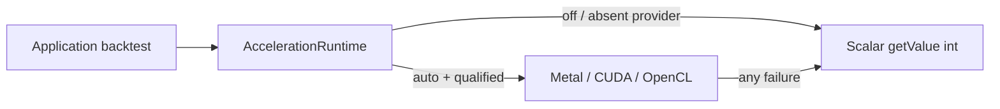

# Transparent Indicator Acceleration

Transparent acceleration lets an ordinary `BarSeriesManager` backtest batch eligible Monte Carlo price-forecast work onto a GPU **without changing your strategy, indicator, executor, or trading-record API**. `Indicator#getValue(int)` stays the scalar correctness oracle and `Indicator#stream()` is unchanged; the runtime decides internally whether a qualified backend is worth using.

This page covers operators of ta4j applications that want GPU acceleration. For the `ta4j-cli` command-line tool that ships the acceleration providers, see the [ta4j-cli Operator Guide](ta4j-cli-operator-guide.md).

## How It Works

Acceleration is opt-in and fail-safe by construction:

- The default (`-Dta4j.acceleration=off`, or omitting the property) performs **no provider discovery and no native loading**.
- `auto` discovers providers lazily, only after a supported indicator is reached.
- If a provider is absent, the graph is unsupported, input is stale, memory is limited, or the native path fails, the runtime **recomputes the full scalar result**. No partial GPU result is ever published.



Only two production values are accepted: `off` and `auto`. There are no production `cpu`, `metal`, `cuda`, or `hybrid` modes; backend forcing is reserved for the package-private qualification tests so applications cannot accidentally bypass the measured crossover policy.

## Enabling Acceleration

The acceleration runtime boundary ships in `ta4j-core` with no native or platform dependency. The optional providers ship with `ta4j-cli`; add `ta4j-cli` (or its native classifier jar) to the application classpath alongside `ta4j-core`, then launch with:

```text
-Dta4j.acceleration=auto
```

The default `ta4j-cli` jar remains JVM-only. Native builds attach platform classifiers:

```bash
./mvnw -pl ta4j-cli -am -Pmetal-macos-aarch64 package
./mvnw -pl ta4j-cli -am -Pcuda-linux-x86_64 package
./mvnw -pl ta4j-cli -am -Popencl-linux-x86_64 package
./mvnw -pl ta4j-cli -am -Popencl-linux-aarch64 package
```

```powershell
mvnw.cmd -pl ta4j-cli -am -Pcuda-windows-x86_64 package
```

Packaged libraries carry SHA-256 sidecars and are extracted atomically below `~/.ta4j/native/`. Absolute developer builds can be supplied with `ta4j.acceleration.metal.library`, `ta4j.acceleration.cuda.library`, or `ta4j.acceleration.opencl.library`. On a JVM that restricts native access, add `--enable-native-access=ALL-UNNAMED`.

## Platform Support

| Platform | Backend | Status |
| --- | --- | --- |
| macOS arm64 | Metal | Correctness- and performance-qualified (Apple M5 Max: 2.23x on the checked workload) |
| Windows x86_64 | CUDA | Correctness-qualified (RTX 5090, CUDA 13.3, compute capability 12.0); `auto` conservatively retains scalar execution pending a stronger crossover model |
| Linux x86_64 | CUDA | Classifier packaging present; hardware qualification open (see [Linux CUDA qualification](#linux-cuda-qualification)) |
| Linux x86_64 / aarch64 | OpenCL | Correctness-qualified through the PoCL Docker validation matrix; auto-selection gated to GPU devices with >= 16,777,216 path-steps and >= 2 GiB device memory |

On Linux, the automatic order prefers CUDA when its crossover qualifies and otherwise falls through to OpenCL. OpenCL is the vendor-neutral path: NVIDIA, AMD, Intel, and CPU ICDs (for validation) all execute the same versioned kernels. GPU OpenCL devices are auto-selected once the workload floor and minimum device memory are reached; CPU ICD devices (for example PoCL) execute only through the internal qualification path used by the validation tests. Current macOS releases do not support NVIDIA CUDA or external NVIDIA eGPUs, so Metal and CUDA are not competing production choices on one supported host.

## What Gets Accelerated

Acceleration is deliberately narrow rather than a general indicator-DAG compiler:

- The production provider accepts `DoubleNum` Monte Carlo price forecasts backed by log returns and EWMA state.
- The CPU captures immutable recursive state; the GPU performs terminal-path sampling; Java validates and deterministically materializes the ordered `Forecast` results.
- Close/SMA and unknown or custom graphs remain scalar.
- Metal uses checked whole-decision chunks; CUDA uses the same versioned RNG and forecast fixtures with FP64 reduction. The Java golden corpus covers bounded RNG selection for `1`, `2`, `7`, `252`, `256`, and `1000` paths.

### Determinism and Numerical Tolerance

- The versioned random stream replaces the sequential `SplittableRandom` stream used before 0.23.1. A fixed seed reproduces the same integer random stream in every lane.
- Applications that must reproduce pre-0.23.1 seeded values can restore the legacy stream with `-Dta4j.forecast.rngVersion=0`; while the legacy stream is active, transparent acceleration is disabled so the documented legacy values always materialize (native kernels implement only the versioned stream).
- CUDA retains FP64 while Metal materializes terminal paths in FP32, so cross-lane numeric summaries are checked within the documented tolerance rather than for bit identity; stability, sample counts, quantiles, and trading decisions must still agree.
- Upgrading can change previously recorded Monte Carlo values for the same seed.

## Diagnostics

Set logging for `org.ta4j.core.internal.acceleration.AccelerationRuntime` to `DEBUG` to see the selected backend, typed decision code, native status, timings, and fallback detail.

## Troubleshooting

| Symptom | Likely cause | First place to check |
| --- | --- | --- |
| Acceleration never engages | `auto` not set, classifier jar missing from classpath, or workload not an eligible `DoubleNum` Monte Carlo forecast | [Enabling Acceleration](#enabling-acceleration), [What Gets Accelerated](#what-gets-accelerated) |
| Native library load error | Classifier/OS/arch mismatch, checksum failure, or unwritable `~/.ta4j/native/` | [Enabling Acceleration](#enabling-acceleration), `--enable-native-access=ALL-UNNAMED` |
| OpenCL device not selected | CPU ICD, or GPU below the 16,777,216 path-step / 2 GiB device-memory gates | [Platform Support](#platform-support) |
| Values differ across runs or lanes | Seed or RNG version differences; FP32 vs FP64 lane tolerance | [Determinism and Numerical Tolerance](#determinism-and-numerical-tolerance) |
| Results suddenly scalar | Provider failure or stale input; check DEBUG diagnostics | [Diagnostics](#diagnostics) |

## Rollback

Use `-Dta4j.acceleration=off`, omit `ta4j-cli`, or use the JVM-only artifact for complete rollback.

## Qualification Status

- Apple M5 Max Metal is correctness- and performance-qualified for the checked forecast workload: a 4,096-bar transparent backtest with 256 decisions, 2,048 paths, horizon 32, and lookback 256 measured a 280.196 ms scalar median versus 125.716 ms with Metal (**2.23x**) over five warm trials, with all six positions, operation indexes, 147 bars in market, and ending equity matching.
- Windows RTX 5090 CUDA is correctness-qualified for Windows x86_64, CUDA 13.3, and compute capability 12.0. Existing measurements were not a stable crossover, so `auto` conservatively retains scalar execution there pending a stronger qualified model.
- Linux OpenCL is correctness-qualified through the PoCL Docker validation matrix on both x86_64 and aarch64: the probe self-tests, the full shock-model/volatility parity matrix, and the transparent end-to-end backtest all pass inside a PoCL container.
- Qualification work exposed two pre-release defects, both now covered by regression tests: manager snapshots were initially rejected as non-identical indicator series, and Metal's standardized-empirical EWMA kernel normalized shocks against evolving rather than captured moments.

### Linux CUDA Qualification

The shared CUDA implementation builds from `ta4j-cli/src/main/native/cuda/` for Windows and Linux x86_64. Linux must reuse operation ABI 1, RNG version 1, JNI payload ordering, status meanings, kernel source, golden fixtures, and the `1e-4` FP64 qualification tolerance. Do not change Windows or Metal golden fixtures while Linux hardware qualification is open. The `scripts/acceleration/linux-cuda-handoff.sh` helper prints the required preflight and validation commands.

## Related Pages

- [ta4j-cli Operator Guide](ta4j-cli-operator-guide.md)
- [Performance Characterization](Performance-Characterization.md)
- [Num](Num.md)
- [Forecast Projection Models](Forecast-Projection-Models.md)
