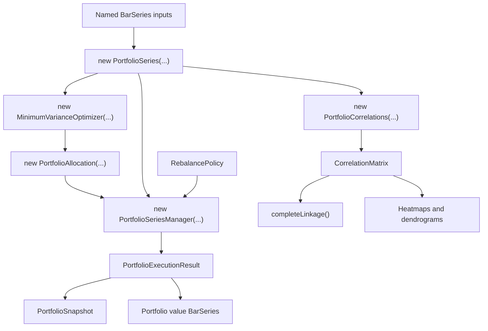

# Portfolio Backtesting and Correlation Analytics

The ta4j 0.23.1 development line introduces a constructor-first multi-asset workflow for strict time alignment, static target-weight execution, correlation and hierarchy analysis, and long-only minimum-variance allocation. The same `PortfolioSeries` drives accounting, optimizers, charts, and reports, so one prepared data window has one asset order and one numeric domain.

Use this feature for deterministic research across two or more assets. Continue to use `BarSeriesManager` or `BacktestExecutor` for a strategy over one `BarSeries`.

**Release status:** This is a preview of APIs on the companion
[`feature/portfolio-correlation-analytics-20260723`](https://github.com/ta4j/ta4j/tree/feature/portfolio-correlation-analytics-20260723)
branch. They are not yet available in a published ta4j release.

## Quick Start

```java
import java.util.LinkedHashMap;
import java.util.Map;
import java.util.Set;

import org.ta4j.core.BarSeries;
import org.ta4j.core.analysis.cost.LinearTransactionCostModel;
import org.ta4j.core.num.Num;
import org.ta4j.core.portfolio.PortfolioAllocation;
import org.ta4j.core.portfolio.PortfolioExecutionResult;
import org.ta4j.core.portfolio.PortfolioSeries;
import org.ta4j.core.portfolio.PortfolioSeriesManager;
import org.ta4j.core.portfolio.RebalancePolicy;

BarSeries equitySeries = ...;
BarSeries bondSeries = ...;
BarSeries commoditySeries = ...;

Map<String, BarSeries> assets = new LinkedHashMap<>();
assets.put("EQUITY", equitySeries);
assets.put("BONDS", bondSeries);
assets.put("COMMODITIES", commoditySeries);
PortfolioSeries portfolio = new PortfolioSeries(assets);

Map<String, Num> weights = new LinkedHashMap<>();
weights.put("EQUITY", portfolio.numFactory().numOf("0.60"));
weights.put("BONDS", portfolio.numFactory().numOf("0.30"));
weights.put("COMMODITIES", portfolio.numFactory().numOf("0.05"));
PortfolioAllocation allocation = new PortfolioAllocation(weights, portfolio.numFactory());

PortfolioSeriesManager manager = new PortfolioSeriesManager(
        portfolio,
        new LinearTransactionCostModel(0.001));
PortfolioExecutionResult result = manager.run(
        allocation,
        portfolio.numFactory().numOf("10000"),
        RebalancePolicy.onIndexes(Set.of(0, 21, 42, 63)));

System.out.println("Final value: " + result.getFinalValue());
System.out.println("Total return: " + result.getTotalReturn());
System.out.println("Costs: " + result.getTotalTransactionCost());
```

The weights sum to `0.95`, so the remaining `0.05` is held as cash. Rebalance trade sizes are solved against post-cost portfolio value and constrained so transaction costs cannot make cash negative.

## Canonical Flow



## Portfolio Series

`PortfolioSeries` snapshots its inputs once and aligns them by the intersection of bar end times present in every source. Missing bars are excluded rather than forward-filled.

Use source names when they are already the desired identifiers:

```java
PortfolioSeries portfolio = new PortfolioSeries(equitySeries, bondSeries);
// Equivalent:
PortfolioSeries fromList = new PortfolioSeries(List.of(equitySeries, bondSeries));
```

Each `BarSeries#getName()` must be nonblank and unique. Use the map constructor for explicit aliases and deterministic encounter order:

```java
Map<String, BarSeries> assets = new LinkedHashMap<>();
assets.put("US_EQUITY", equitySeries);
assets.put("TREASURY", bondSeries);
PortfolioSeries portfolio = new PortfolioSeries(assets);
```

Useful alignment methods:

```java
int barCount = portfolio.getBarCount();
List<Instant> timeline = portfolio.getEndTimes();
Num equityClose = portfolio.getClosePrice("US_EQUITY", 0);
int originalIndex = portfolio.getSourceIndex("US_EQUITY", 0);
BarSeries defensiveCopy = portfolio.getBarSeries("US_EQUITY");
```

The original source index is retained even when an input has a nonzero begin index. Mutating an original input after construction does not change the portfolio snapshot.

Alignment rules:

- At least two nonempty series are required.
- Asset names must be nonblank and unique.
- Every source must share at least one common bar end time.
- Duplicate end times inside one source are rejected.
- Portfolio indexes begin at zero; `getSourceIndex(...)` maps them back to retained source indexes.
- Asset and matrix order follows constructor encounter order.
- The first source supplies the portfolio `NumFactory`; values from other factories are converted without routing through primitive doubles.

Prepare currency conversion, exchange-calendar joins, or intentional carry-forward bars before construction. Strict alignment will not invent those policies.

## Allocations

Use explicit weights when a cash sleeve is intentional:

```java
Map<String, Num> weights = new LinkedHashMap<>();
weights.put("US_EQUITY", numFactory.numOf("0.60"));
weights.put("TREASURY", numFactory.numOf("0.30"));
PortfolioAllocation allocation = new PortfolioAllocation(weights, numFactory);

Num investedWeight = allocation.getTotalWeight(); // 0.90
Num cashWeight = allocation.getCashWeight();      // 0.10
```

Weights must be finite and non-negative, and their sum must not exceed one. A finite `DecimalNum` remains valid even when its primitive `doubleValue()` would overflow.

Use relative weighted values for a normalized, fully invested allocation:

```java
PortfolioAllocation allocation = new PortfolioAllocation(
        List.of(
                new WeightedValue<>("US_EQUITY", numFactory.two()),
                new WeightedValue<>("TREASURY", numFactory.one())),
        numFactory);
```

This constructor normalizes the values to one and combines duplicate asset names. `getTargetWeight(name)` returns zero for an intentionally unallocated asset.

## Execution and Rebalancing

`PortfolioSeriesManager` mirrors the role of `BarSeriesManager`: the constructor owns the series and transaction-cost configuration, while each `run(...)` supplies an allocation and starting cash.

```java
PortfolioSeriesManager manager = new PortfolioSeriesManager(portfolio);
PortfolioExecutionResult initialOnly =
        manager.run(allocation, numFactory.numOf("10000"));

PortfolioExecutionResult scheduled = manager.run(
        allocation,
        numFactory.numOf("10000"),
        RebalancePolicy.onIndexes(Set.of(0, 63, 126, 189)));
```

The two-argument `run(...)` performs an initial rebalance. Available policies are:

```java
RebalancePolicy.atStart();
RebalancePolicy.everyBar();
RebalancePolicy.onIndexes(Set.of(0, 20, 40));
RebalancePolicy monthEnd = index -> monthEndIndexes.contains(index);
```

`RebalancePolicy` is a functional interface. Derive calendar-aware indexes from `portfolio.getEndTimes()` and capture them in a lambda or `onIndexes(...)`.

Use any ta4j `CostModel`:

```java
PortfolioSeriesManager manager = new PortfolioSeriesManager(
        portfolio,
        new LinearTransactionCostModel(0.001));
```

Execution is long-only and uses fractional units. Buys and sells are reduced or skipped when a fixed or step-like transaction cost would otherwise make cash negative. Invalid, negative, or non-finite costs are rejected.

## Snapshots and Results

Output types are immutable and created by the manager:

```java
for (PortfolioSnapshot snapshot : result.getSnapshots()) {
    System.out.printf(
            "index=%d value=%s cash=%s turnover=%s%n",
            snapshot.getIndex(),
            snapshot.getPortfolioValue(),
            snapshot.getCash(),
            snapshot.getTurnover());
}
```

| Snapshot method | Meaning |
| --- | --- |
| `getIndex()` / `getEndTime()` | Aligned portfolio location. |
| `getPrices()` | Close prices used for valuation. |
| `getHoldings()` | Fractional units after any rebalance. |
| `getCash()` | Cash after trades and costs. |
| `getPortfolioValue()` | Cash plus marked-to-market holdings. |
| `getPeriodReturn()` | Return since the previous snapshot, net of costs. |
| `getTransactionCost()` | Costs paid at this snapshot. |
| `getTurnover()` | Gross traded notional, excluding costs. |
| `getAssetValue(name)` | Marked-to-market asset value. |
| `getAssetWeight(name)` | Actual marked-to-market asset weight. |

Result summaries include `getFinalValue()`, `getTotalReturn()`, `getTotalTransactionCost()`, `getTotalTurnover()`, and `getFinalWeights()`.

Export the equity curve for normal ta4j indicators and criteria:

```java
BarSeries equityCurve = result.toPortfolioValueSeries("portfolio-value");
ClosePriceIndicator value = new ClosePriceIndicator(equityCurve);
SMAIndicator smoothedValue = new SMAIndicator(value, 20);
```

## Correlation Matrices

Construct analytics once for the aligned series:

```java
PortfolioCorrelations correlations = new PortfolioCorrelations(portfolio);

CorrelationMatrix prices = correlations.getPriceMatrix();
CorrelationMatrix simpleReturns = correlations.getSimpleReturnMatrix();
CorrelationMatrix logReturns = correlations.getLogReturnMatrix();
```

Full-history methods end at the final aligned index. Rolling and historical forms make the decision index and observation count explicit:

```java
CorrelationMatrix rolling = correlations.getSimpleReturnMatrix(60);
CorrelationMatrix historical =
        correlations.getLogReturnMatrix(index, 120, SampleType.SAMPLE);

Num coefficient = historical.getCoefficient("US_EQUITY", "TREASURY");
List<CorrelationPair> pairs = historical.getPairs();
```

`getPriceMatrix(...)` counts prices. Simple- and log-return windows count one-bar returns, so they need one earlier price. `isStable()` reports whether the requested index contains the complete transform and correlation window; unavailable off-diagonal values are `NaN`.

## Complete-Linkage Hierarchy

Every finite matrix can produce a deterministic hierarchy:

```java
CorrelationHierarchy hierarchy = simpleReturns.completeLinkage();

for (ClusterMerge merge : hierarchy.getMerges()) {
    System.out.printf(
            "%d + %d distance=%s size=%d%n",
            merge.getLeftClusterIndex(),
            merge.getRightClusterIndex(),
            merge.getDistance(),
            merge.getSize());
}
System.out.println(hierarchy.getLeafOrder());
```

`completeLinkage()` matches `scipy.cluster.hierarchy.linkage(matrix, method="complete")`: each asset is represented by its complete correlation row, row distance is Euclidean, and cluster distance is the maximum pairwise row distance. Leaf cluster indexes are `0..assetCount-1`; each merge receives the next index.

A matrix containing `NaN` or infinite coefficients is rejected rather than silently clustered.

## Minimum-Variance Allocation

`MinimumVarianceOptimizer` estimates a population covariance matrix from aligned one-bar simple returns and minimizes portfolio variance subject to non-negative weights summing to one.

```java
PortfolioAllocation pure =
        new MinimumVarianceOptimizer(portfolio).optimize();

PortfolioAllocation capped =
        new MinimumVarianceOptimizer(
                portfolio,
                portfolio.numFactory().numOf("0.25"))
                .optimize();
```

The uncapped result is the mathematical long-only optimum for the estimated covariance matrix. A maximum weight can make the result more practical and diversified; it must be feasible for the number of assets.

Historical windows are explicit and do not read future bars:

```java
PortfolioAllocation walkForwardAllocation =
        new MinimumVarianceOptimizer(
                portfolio,
                decisionIndex,
                120,
                portfolio.numFactory().numOf("0.25"))
                .optimize();
```

All covariance, projection, and convergence calculations use `Num`. The deterministic bounded-simplex projected-gradient solver supports singular covariance matrices without inversion. It rejects non-positive or non-finite prices, fewer than two return observations, infeasible caps, and numerical non-convergence.

## Adjusted Yahoo Data

The examples module can load Yahoo data with yfinance-style `auto_adjust=True` behavior:

```java
BarSeries adjusted =
        YahooFinanceHttpBarSeriesDataSource.loadAdjustedSeries(
                "QQQ",
                YahooFinanceInterval.DAY_1,
                start,
                end);
```

Yahoo's adjusted-close ratio is applied to open, high, low, and close; volume is retained. Existing `loadSeries(...)` and `loadSeriesInstance(...)` methods continue to return raw prices.

For daily multi-asset research, normalize end times to one calendar convention before constructing `PortfolioSeries`. The runnable portfolio examples show a UTC-date normalization step.

## Heatmaps, Dendrograms, and Reports

`PortfolioCorrelationChartFactory` in `ta4j-examples` creates headless-safe JFreeChart output:

```java
PortfolioCorrelationChartFactory charts =
        new PortfolioCorrelationChartFactory();

JFreeChart heatmap =
        charts.createHeatmap("Return correlations", simpleReturns);
JFreeChart dendrogram =
        charts.createDendrogram(
                "Correlation hierarchy",
                simpleReturns.completeLinkage());
```

The anonymous `DiversifiedPortfolioAnalysis` example uses adjusted YTD data for:

`QQQ, VWO, COIN, FBTC, IBIT, ETHW, RES, XOM, DOC, NKE, ARKK, TLT`

It writes:

- adjusted-price heatmap and dendrogram
- simple-return heatmap and dendrogram
- equal-weight, pure minimum-variance, and 25%-capped allocations
- `report.html`
- `portfolio-analysis.xlsx`
- `ai-analysis-prompt.md`

Run it from the ta4j repository root:

```bash
./mvnw -pl ta4j-examples -am install
./mvnw -pl ta4j-examples exec:java \
  -Dexec.mainClass=ta4jexamples.portfolio.DiversifiedPortfolioAnalysis
```

The example does not call an AI service. To embed a response from an external model, save the response to a file and rerun:

```bash
./mvnw -pl ta4j-examples exec:java \
  -Dexec.mainClass=ta4jexamples.portfolio.DiversifiedPortfolioAnalysis \
  -Dexec.args="--ai-analysis=/path/to/response.md"
```

The response is HTML-escaped before it is embedded. Use `--output=/path/to/directory` to select another output directory.

## No-Look-Ahead Contract

Correlation and optimization constructors with an explicit index read prices only through that index. A rolling rebalance loop should compute an allocation at decision index `i`, then apply it according to the execution timing in the research design.

Do not estimate one full-history allocation and present it as a historical strategy. That is an in-sample description, not a walk-forward backtest.

## Common Pitfalls

- **Mismatched calendars:** Alignment is an intersection. Normalize intentional calendar differences first.
- **Raw equity prices:** Splits and distributions can dominate price correlations. Prefer adjusted prices for this analysis.
- **Price correlations as diversification proof:** Price levels can be jointly trending. Inspect return correlations too.
- **Implicit cash:** Explicit weights below one create a cash sleeve; relative `WeightedValue` inputs normalize to full investment.
- **Infeasible caps:** A 25% cap needs at least four assets.
- **Short histories:** Correlation and covariance estimates are fragile with few observations.
- **Full-history optimization:** It is descriptive unless the allocation is estimated independently at each historical decision point.
- **Execution realism:** Cost models are supported, but slippage, taxes, FX conversion, borrowing, and order-book fills are outside this static manager.
- **Personalized advice:** Minimum variance minimizes estimated variance only. It does not know an investor's goals, liabilities, taxes, or risk capacity.

## Public Type Map

| Type | Purpose |
| --- | --- |
| `PortfolioSeries` | Snapshot and strict common-end-time alignment of named asset series. |
| `PortfolioAllocation` | Long-only explicit or normalized target weights. |
| `PortfolioSeriesManager` | Cost-aware target-weight execution. |
| `RebalancePolicy` | Functional rebalance schedule. |
| `PortfolioSnapshot` | Immutable state at one aligned bar. |
| `PortfolioExecutionResult` | Immutable execution summary and equity-curve export. |
| `PortfolioCorrelations` | Price, simple-return, and log-return matrices. |
| `CorrelationMatrix` | Immutable matrix, pairs, stability metadata, and hierarchy entrypoint. |
| `CorrelationHierarchy` / `ClusterMerge` | Complete-linkage result. |
| `MinimumVarianceOptimizer` | Num-native long-only covariance optimizer. |

## Runnable Examples

- [`StaticPortfolioBacktest`](https://github.com/ta4j/ta4j/blob/feature/portfolio-correlation-analytics-20260723/ta4j-examples/src/main/java/ta4jexamples/portfolio/StaticPortfolioBacktest.java)
- [`PortfolioCorrelationAnalysis`](https://github.com/ta4j/ta4j/blob/feature/portfolio-correlation-analytics-20260723/ta4j-examples/src/main/java/ta4jexamples/portfolio/PortfolioCorrelationAnalysis.java)
- [`DiversifiedPortfolioAnalysis`](https://github.com/ta4j/ta4j/blob/feature/portfolio-correlation-analytics-20260723/ta4j-examples/src/main/java/ta4jexamples/portfolio/DiversifiedPortfolioAnalysis.java)

For general strategy mechanics, see [Backtesting](Backtesting.md). For promotion gates and realism checks, see [Backtesting Realism Checklist](Backtesting-Realism-Checklist.md).
