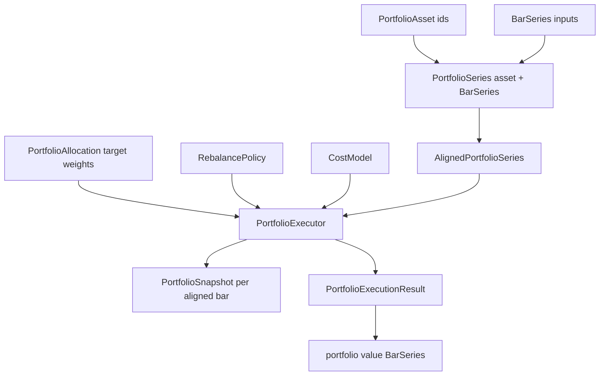

# Static Portfolio Backtesting

Static portfolio backtesting runs one deterministic, multi-asset portfolio simulation from aligned `BarSeries` inputs and explicit target weights. Use it when you want portfolio-level accounting, cash, transaction costs, turnover, and an equity curve without stitching together several independent single-series backtests.

The portfolio API lives under `org.ta4j.core.portfolio`. The first slice is intentionally static target-weight accounting: it does not optimize allocations, run per-asset strategies, model shorting/leverage, or replace `BarSeriesManager` for normal single-series strategy backtests.

**Release status:** These APIs are introduced by the CF-148 feature branch and should be published with ta4j 0.23.1 or newer. Until that ta4j change is merged and released, use this guide with the matching ta4j branch rather than the current release artifacts.

## When to use it

Use static portfolio backtesting when you want to answer questions such as:

- How would a fixed 60/30/10 allocation have behaved over this shared timeline?
- How much cash remains after transaction costs and scheduled rebalances?
- What was the portfolio value, turnover, or per-asset weight at each bar?
- Can I export a portfolio equity curve as a normal `BarSeries` for indicators or criteria?
- How does a target allocation drift between scheduled rebalance dates?

Do not use it for a single-asset strategy. For one `BarSeries`, use `BarSeriesManager`, `BacktestExecutor`, and normal strategy rules. `AlignedPortfolioSeries` deliberately requires at least two source assets.

## Quick Start

The core flow is:

1. Create one `PortfolioAsset` per asset.
2. Pair each asset with its source `BarSeries`.
3. Align the series by common bar end times.
4. Define target weights and the residual cash sleeve.
5. Run `PortfolioExecutor`.
6. Inspect snapshots or export the portfolio value series.

```java
import java.util.LinkedHashMap;
import java.util.List;
import java.util.Map;
import java.util.Set;

import org.ta4j.core.BarSeries;
import org.ta4j.core.analysis.cost.LinearTransactionCostModel;
import org.ta4j.core.num.Num;
import org.ta4j.core.portfolio.AlignedPortfolioSeries;
import org.ta4j.core.portfolio.PortfolioAllocation;
import org.ta4j.core.portfolio.PortfolioAsset;
import org.ta4j.core.portfolio.PortfolioExecutionResult;
import org.ta4j.core.portfolio.PortfolioExecutor;
import org.ta4j.core.portfolio.PortfolioSeries;
import org.ta4j.core.portfolio.RebalancePolicy;

BarSeries equitySeries = ...;
BarSeries bondSeries = ...;
BarSeries commoditySeries = ...;

PortfolioAsset equity = PortfolioAsset.of("EQUITY");
PortfolioAsset bonds = PortfolioAsset.of("BONDS");
PortfolioAsset commodities = PortfolioAsset.of("COMMODITIES");

AlignedPortfolioSeries portfolioSeries = AlignedPortfolioSeries.of(List.of(
        new PortfolioSeries(equity, equitySeries),
        new PortfolioSeries(bonds, bondSeries),
        new PortfolioSeries(commodities, commoditySeries)));

Map<PortfolioAsset, Num> targetWeights = new LinkedHashMap<>();
targetWeights.put(equity, equitySeries.numFactory().numOf("0.60"));
targetWeights.put(bonds, equitySeries.numFactory().numOf("0.30"));
targetWeights.put(commodities, equitySeries.numFactory().numOf("0.05"));

PortfolioAllocation allocation =
        PortfolioAllocation.targetWeights(targetWeights, equitySeries.numFactory());

PortfolioExecutionResult result = new PortfolioExecutor(
        portfolioSeries,
        allocation,
        equitySeries.numFactory().numOf("10000"),
        RebalancePolicy.onIndexes(Set.of(0, 21, 42, 63)),
        new LinearTransactionCostModel(0.001))
        .run();

System.out.println("Final value: " + result.finalValue());
System.out.println("Total return: " + result.totalReturn());
System.out.println("Costs: " + result.totalTransactionCost());
```

The weights above sum to `0.95`, so the remaining `0.05` is a cash target. Transaction costs are solved against post-cost portfolio value, so a configured cash sleeve remains represented after costs are applied.

## Architecture



The important types are:

| Type | Responsibility |
| --- | --- |
| `PortfolioAsset` | Stable, trimmed asset identifier such as `EQUITY`, `BTC`, or `BONDS`. |
| `PortfolioSeries` | Pairing of one `PortfolioAsset` with one source `BarSeries`. |
| `AlignedPortfolioSeries` | Strict common-end-time alignment and portfolio-level `NumFactory` selection. |
| `PortfolioAllocation` | Long-only target weights with residual cash. |
| `RebalancePolicy` | Index-based rebalance schedule. |
| `PortfolioExecutor` | Deterministic accounting loop with fractional units and transaction costs. |
| `PortfolioSnapshot` | One post-rebalance portfolio state at one aligned bar. |
| `PortfolioExecutionResult` | Final summary, cumulative metrics, final weights, and value-series export. |

## Data preparation and alignment

`AlignedPortfolioSeries` aligns source series by the intersection of bar end times present in every asset. Missing bars are excluded up front; they are not forward-filled.

This is deliberate. Silent forward-fill can hide venue closures, stale prices, or calendar mismatches. If your research needs exchange-calendar joins, currency conversion, or synthetic carry-forward bars, prepare those inputs before creating the portfolio series.

```java
AlignedPortfolioSeries aligned = AlignedPortfolioSeries.of(List.of(
        PortfolioSeries.of("EQUITY", equitySeries),
        PortfolioSeries.of("BONDS", bondSeries)));

int alignedBars = aligned.getBarCount();
Num equityClose = aligned.getClosePrice(PortfolioAsset.of("EQUITY"), 0);
int originalEquityIndex = aligned.getSourceIndex(PortfolioAsset.of("EQUITY"), 0);
```

Alignment rules:

- At least two assets are required.
- Asset ids must be unique.
- Each asset source must share at least one common bar end time with every other source.
- Duplicate bar end times inside one source series are rejected.
- Output asset order follows the input order.

## Target weights and cash

Use `PortfolioAllocation.targetWeights(...)` when weights are already expressed as portfolio fractions:

```java
Map<PortfolioAsset, Num> weights = new LinkedHashMap<>();
weights.put(equity, numFactory.numOf("0.60"));
weights.put(bonds, numFactory.numOf("0.30"));

PortfolioAllocation allocation = PortfolioAllocation.targetWeights(weights, numFactory);
Num cashWeight = allocation.cashWeight(); // 0.10
```

Weights must be finite and non-negative. The sum must be less than or equal to `1`; any remainder is held as cash. Tiny numerical overshoots at the `1.0` boundary are normalized back to fully invested, while clearly leveraged allocations are rejected.

Use `PortfolioAllocation.fullyInvested(...)` when you have relative scores or weights that should be normalized to `1`:

```java
PortfolioAllocation allocation = PortfolioAllocation.fullyInvested(List.of(
        new WeightedValue<>(equity, numFactory.two()),
        new WeightedValue<>(bonds, numFactory.one())),
        numFactory);
```

`fullyInvested(...)` reuses ta4j's shared `WeightedValue.normalizeWeights(...)` primitive and combines duplicate asset entries after normalization.

## Rebalance policies

`RebalancePolicy` decides whether a rebalance happens at an aligned portfolio index:

```java
RebalancePolicy atStart = RebalancePolicy.atStart();
RebalancePolicy everyBar = RebalancePolicy.everyBar();
RebalancePolicy quarterlyApproximation = RebalancePolicy.onIndexes(Set.of(0, 63, 126, 189));
```

The policy is index-based, not calendar-aware. If you want true calendar schedules such as month-end or quarter-end, compute those aligned indexes from `AlignedPortfolioSeries.endTimes()` and pass them to `onIndexes(...)`.

Between rebalance dates, holdings drift naturally as asset prices move. Snapshots still record every aligned bar.

## Transaction costs and cash sleeves

`PortfolioExecutor` accepts any ta4j `CostModel` through the constructor overload:

```java
PortfolioExecutionResult result = new PortfolioExecutor(
        portfolioSeries,
        allocation,
        numFactory.numOf("10000"),
        RebalancePolicy.atStart(),
        new LinearTransactionCostModel(0.001))
        .run();
```

The executor computes target notionals against post-cost portfolio value. For example, with a 60% equity / 30% bonds / 10% cash allocation and non-zero transaction costs, the executed trade sizes are reduced so the resulting snapshot still reflects the configured cash sleeve as closely as the active `Num` precision and cost model allow.

For buys, the executor also checks affordability against `gross + cost(gross) <= cash`. If a fixed, step, or otherwise non-proportional cost model makes the desired gross buy unaffordable, the buy is reduced to the largest affordable gross amount instead of spending cash negative. Extreme cost models can therefore leave a portfolio underinvested, which is preferable to silently creating impossible cash.

The default four-argument constructor uses `ZeroCostModel`.

## Reading snapshots

`PortfolioExecutionResult.snapshots()` returns one `PortfolioSnapshot` per aligned bar after any scheduled rebalance at that bar.

```java
for (PortfolioSnapshot snapshot : result.snapshots()) {
    System.out.printf(
            "index=%d value=%s cash=%s turnover=%s%n",
            snapshot.index(),
            snapshot.portfolioValue(),
            snapshot.cash(),
            snapshot.turnover());
}
```

Common snapshot fields:

| Field or method | Meaning |
| --- | --- |
| `index()` | Aligned portfolio index. |
| `endTime()` | Common aligned bar end time. |
| `prices()` | Close prices used for valuation. |
| `holdings()` | Fractional units held after any rebalance. |
| `cash()` | Cash after trades and costs. |
| `portfolioValue()` | Cash plus marked-to-market holdings. |
| `periodReturn()` | Return from the previous snapshot to this snapshot, net of costs. |
| `transactionCost()` | Costs paid at this snapshot. |
| `turnover()` | Gross notional traded at this snapshot, excluding costs. |
| `assetValue(asset)` | Marked-to-market value for one asset. |
| `assetWeight(asset)` | Actual marked-to-market asset weight. |

Maps exposed by the portfolio result and snapshots preserve deterministic asset order for normal iteration.

## Result metrics and value-series export

`PortfolioExecutionResult` exposes common portfolio-level summaries:

```java
Num finalValue = result.finalValue();
Num totalReturn = result.totalReturn();
Num totalCost = result.totalTransactionCost();
Num totalTurnover = result.totalTurnover();
Map<PortfolioAsset, Num> finalWeights = result.finalWeights();
```

Use `toPortfolioValueSeries(...)` when you want to feed the portfolio equity curve into existing ta4j indicators, criteria, charts, or reports:

```java
BarSeries equityCurve = result.toPortfolioValueSeries("static-portfolio-value");
ClosePriceIndicator portfolioValue = new ClosePriceIndicator(equityCurve);
SMAIndicator smoothedValue = new SMAIndicator(portfolioValue, 20);
```

The exported series has one bar per portfolio snapshot. OHLC values are all set to the snapshot portfolio value, volume is zero, and each bar uses the time period from the first asset's aligned source bar.

## Runnable example

The companion runnable example is:

- [`ta4jexamples.portfolio.StaticPortfolioBacktest`](https://github.com/ta4j/ta4j/blob/master/ta4j-examples/src/main/java/ta4jexamples/portfolio/StaticPortfolioBacktest.java)

Run it from the ta4j repository root:

```bash
mvn -pl ta4j-examples exec:java -Dexec.mainClass=ta4jexamples.portfolio.StaticPortfolioBacktest
```

Expected output includes:

- aligned bar count
- final portfolio value
- total return
- cumulative transaction costs
- one snapshot line per aligned bar

Use the example as a shape for your own research harness: replace the synthetic series with real normalized bars, keep the asset ids stable, and derive the `NumFactory` from one of the source series.

## Common pitfalls

- **Mismatched calendars:** The aligned timeline is an intersection. If one asset misses a bar, that end time is removed for every asset.
- **Implicit cash assumptions:** Weights that sum below `1` intentionally create a cash sleeve. Use `fullyInvested(...)` if you want no residual cash.
- **Single-asset use:** This API is for multi-asset portfolio accounting. Single-series strategies should use `BarSeriesManager` or `BacktestExecutor`.
- **Optimizer expectations:** Markowitz, HRP, entropy, risk parity, and universal portfolio optimizers are not part of this first API slice.
- **Execution realism:** Transaction costs are supported, but broker order books, slippage, partial fills, FX conversion, taxes, and borrowing are outside this static portfolio executor.
- **Moving series:** Prepare fixed research windows when comparing assets. Moving `BarSeries` inputs can evict older bars before alignment if they are not configured carefully.

## Where this fits

Static portfolio backtesting complements, rather than replaces, ta4j's strategy backtest APIs:

| Need | Use |
| --- | --- |
| One strategy over one series | `BarSeriesManager` |
| Many strategies over one series | `BacktestExecutor` |
| Manual broker/fill replay | `BaseTradingRecord` with fill-driven loops |
| One static target-weight portfolio over multiple series | `org.ta4j.core.portfolio` |

The natural next steps after a static portfolio run are:

- export the value series and calculate criteria
- compare scheduled rebalance policies
- test cost sensitivity
- feed final snapshots into reports or charts
- build allocation research outside core, then pass the resulting static weights into `PortfolioAllocation`

For general backtesting mechanics, see [Backtesting](Backtesting.md). For promotion gates and realism checks, see [Backtesting Realism Checklist](Backtesting-Realism-Checklist.md).
