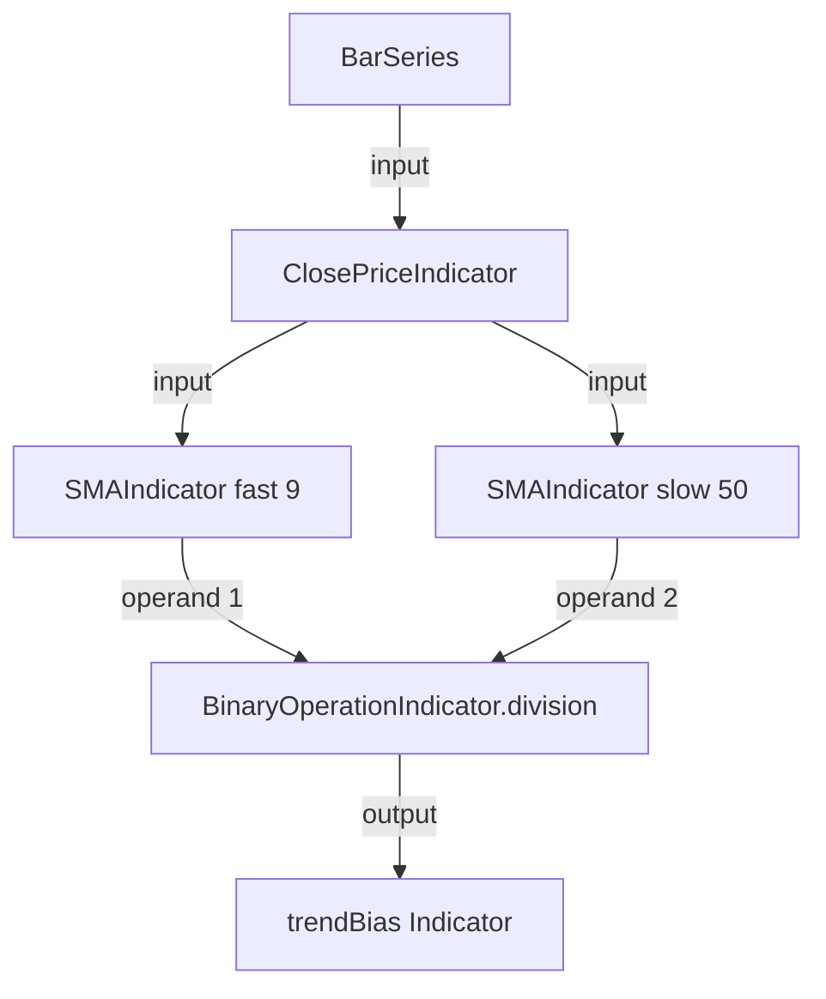

# Technical Indicators

Technical indicators (a.k.a. *technicals*) transform price/volume data into structured signals that power rules and strategies. ta4j currently ships with hundreds of indicator classes under `org.ta4j.core.indicators`, covering every major category plus building blocks for your own creations.

**Exhaustive list:** For a full inventory of all indicators in ta4j-core and ta4j-examples (fully qualified names, class names, short descriptions, and usage notes), see [Indicators Inventory](Indicators-Inventory.md).

| Category | Highlights | Docs |
| --- | --- | --- |
| Trend / Moving Averages | SMA, EMA, HMA, VIDYA, Jurik, Displaced variants, SuperTrend, Renko helpers. | [Moving Average Indicators](Moving-Average-Indicators.md) |
| Momentum & Oscillators | RSI family, NetMomentum, MACD/MACDV, MACD-V momentum states, KST, Stochastics, CMO, ROC. | This page |
| Regime & signal quality | TrendScore, TrendConclusion, Compression, EntryEdge, EdgeDecaySlope, StretchZScore. | This page |
| State estimation & robust smoothing | Kalman filtering, correntropy outlier rejection, measurement-weight and residual diagnostics. | This page |
| Advanced correlation | Kendall tau, Spearman, lagged/distance/regime-segmented correlation, mutual information. | [Indicators Inventory §11](Indicators-Inventory.md#11-statistics--numeric) |
| Forecasting | Provenance-aware Num forecasts, canonical return moments, exact Monte Carlo paths, state-conditioned analogs, rolling conformal calibration, schemas, point projections, and an explicit analytic lognormal approximation. | [Forecast Indicators](Forecast-Indicators.md), [Forecast Projection Models](Forecast-Projection-Models.md) |
| Volatility & Bands | ATR, Donchian, Bollinger, Keltner, Average True Range trailing stops. | [Bar Series & Bars](Bar-series-and-bars.md) (for ATR-based stops) |
| Volume & Breadth | OBV, VWAP/VWMA, Accumulation/Distribution, Chaikin, Force Index, Ease of Movement, Klinger Volume Oscillator. | Indicators package |
| Market Structure (VWAP/SR/Wyckoff) | Anchored VWAP, VWAP bands/z-score, price clusters, bounce counts, KDE volume profile, Wyckoff phase/cycle detection. | [VWAP, Support/Resistance, and Wyckoff Guide](VWAP-Support-Resistance-and-Wyckoff.md) |
| Bill Williams Toolkit | Alligator (jaw/teeth/lips), FractalHigh/Low, Gator Oscillator, Market Facilitation Index. | [Bill Williams Indicators](Bill-Williams-Indicators.md) |
| Candle/Pattern | CandleBody/CandleRange geometry, upper/lower shadows, Hammer, Shooting Star, Three White Soldiers. | This page |
| Price Transformations | RenkoUp/Down/X (0.19), Heikin Ashi builders, `BinaryOperationIndicator`/`UnaryOperationIndicator` transforms. | `indicators.renko` |
| Oscillators | TrueStrengthIndex, SchaffTrendCycle, ConnorsRSI (0.21.0), RSI family, MACD/MACDV, KST, Stochastics, CMO, ROC. | This page |

Browse `org.ta4j.core.indicators` in your IDE for the full list—packages mirror the table above.

## Composition example



```java
ClosePriceIndicator close = new ClosePriceIndicator(series);
SMAIndicator fast = new SMAIndicator(close, 9);
SMAIndicator slow = new SMAIndicator(close, 50);
MACDVIndicator macdv = new MACDVIndicator(series, 12, 26, 9);
NetMomentumIndicator netMomentum = new NetMomentumIndicator(series, 14);

Indicator<Num> trendBias = BinaryOperationIndicator.division(fast, slow);
Indicator<Num> blendedMomentum = BinaryOperationIndicator.add(macdv.getMacd(), netMomentum);
```

- `BinaryOperationIndicator` / `UnaryOperationIndicator` are the preferred numeric composition APIs for new code; `CombineIndicator` remains available in `org.ta4j.core.indicators.helpers`.
- Output indicators can feed directly into rules (`new OverIndicatorRule(trendBias, numOf(1.0))`) or become inputs to other indicators.

## Serialization and shorthand

Indicators can be persisted with canonical JSON:

```java
String json = rsi.toJson();
Indicator<?> restored = Indicator.fromJson(series, json);
```

The companion ta4j PR #1507, targeting 0.23.1, also lets common indicators be authored through named expressions:

```java
Indicator<?> sma = Indicator.fromExpression(series, "SMA(21)");
Indicator<?> rsiOfSma = Indicator.fromExpression(series, "RSI(SMA(14),9)");
```

See [Serialization and Named Shorthand](Serialization-and-Named-Shorthand.md) for the full preview guide to strategy, rule, indicator, and analysis-criterion serialization in that PR.

## Candlestick foundation (0.24.2 development)

Candlestick patterns are easier to reason about when **geometry** and **direction** are separate concepts. This distinction matters in current development code: the latest stable release is **0.24.1**, while the geometry foundation below targets **0.24.2** and should not be copied into code that must compile against 0.24.1.

For a well-formed OHLC bar, the core candle measurements are:

| Quantity | ta4j type | Definition |
| --- | --- | --- |
| Body magnitude | `CandleBodyIndicator` | `abs(close - open)` |
| Upper shadow | `UpperShadowIndicator` | `high - max(open, close)` |
| Lower shadow | `LowerShadowIndicator` | `min(open, close) - low` |
| Full candle range | `CandleRangeIndicator` | `high - low` |

`CandleRangeIndicator` is not true range: true range also considers the previous close, while candle range uses only the current bar. These geometry indicators have no lookback warm-up themselves and produce non-negative measurements for valid OHLC data.

### Migrate body size away from `RealBodyIndicator`

`RealBodyIndicator` is deprecated on the 0.24.2 development branch. It returns the legacy **signed** quantity `close - open`: positive for a bullish candle and negative for a bearish candle. That is useful only when signed close-to-open change is intentionally what you want; it is not a body-size measurement.

Use `CandleBodyIndicator` for body magnitude and `Bar#isBullish()` / `Bar#isBearish()` for direction. Keeping magnitude and direction separate avoids sign-dependent bugs when comparing body sizes, ratios, or thresholds.

### Pattern thresholds need history

Recent 0.24.2 candlestick work also moves pattern classification toward shared, causal recent-history thresholds. The shared support used by pattern indicators computes baselines from **preceding candles only**, so the candle being classified does not influence its own baseline. The current recommended shared profile uses a five-candle prior window and compares body/shadow geometry with recent average body or range.

The support object itself is package-private implementation detail; use the public pattern indicators. Exact constructor semantics and unstable-bar counts remain indicator-specific, so respect `getCountOfUnstableBars()` rather than assuming that every pattern becomes meaningful at index zero. During warm-up, a `false` result can mean “not yet confirmable,” not evidence for the opposite pattern.

### Pattern name is not a strategy

A hammer, engulfing candle, star, or similar pattern describes geometry plus local context; it is not evidence of profitability by itself. Treat candlestick indicators as features or conditions to compose with trend/regime, volatility, volume, support/resistance, or other strategy logic, then evaluate the resulting strategy with realistic backtesting assumptions.

Also avoid assuming that the same pattern name implies identical thresholds across libraries or textbooks. When exact semantics matter, check the current constructor, Javadocs, and unstable-bar behavior.

### OHLC data must be internally consistent

The 0.24.2 development branch tightens `BaseBar` validation so contradictory high/low values relative to open and close are rejected. That protects body, shadow, and range algebra from nonsensical negative geometry. If an upgrade exposes invalid bars, fix the source feed rather than weakening candlestick calculations.

For a live candle that is still changing, the same geometry may legitimately change until the bar closes. See [Live Candle vs Closed Candle](Live-Candle-vs-Closed-Candle-Evaluation.md) when deciding whether a strategy should act on the mutable current bar or only on closed candles.

## Robust Kalman smoothing (0.24.2 development)

Kalman filters estimate a latent current state from noisy observations. They are **same-index smoothers**, not forward forecasts: `getValue(i)` uses information available through index `i`. The latest stable release is **0.24.1**; the correntropy API below is on the **0.24.2 development branch**.

Choose the estimator by the noise problem you actually have:

| Need | Prefer | Why |
| --- | --- | --- |
| Ordinary recursive smoothing where large residuals should still influence the estimate | `KalmanFilterIndicator` | Standard linear Kalman update; simple and inexpensive. |
| Outlier-prone measurements where isolated spikes should lose influence | `CorrentropyKalmanFilterIndicator` | Maximum-correntropy update applies a redescending measurement weight and can reject extreme observations. |
| Inspect why the robust estimate ignored or accepted a measurement | `measurementWeight()` and `residual()` | Weight reports measurement acceptance in `[0, 1]`; residual reports `source - robustEstimate`. |

### The 60-second path

The complete runnable owner is [`CorrentropyKalmanExample`](https://github.com/ta4j/ta4j/blob/master/ta4j-examples/src/main/java/ta4jexamples/analysis/forecast/CorrentropyKalmanExample.java). Its core composition is:

```java
ClosePriceIndicator close = new ClosePriceIndicator(series);
ATRIndicator atr = new ATRIndicator(series, 14);

NumericIndicator atrVariance = NumericIndicator.of(atr).squared();
KalmanNoiseIndicator processNoise = new KalmanNoiseIndicator(
        atrVariance.multipliedBy(0.0625).max(1e-8));
KalmanNoiseIndicator measurementNoise = new KalmanNoiseIndicator(
        atrVariance.multipliedBy(0.25).max(1e-8));

CorrentropyKalmanFilterIndicator robust =
        new CorrentropyKalmanFilterIndicator(
                close,
                processNoise,
                measurementNoise,
                series.numFactory().numOf(2.0));

CorrentropyKalmanWeightIndicator weight = robust.measurementWeight();
Indicator<Num> residual = robust.residual();
```

Those ATR coefficients are an **illustrative recipe from the compiled example, not calibrated defaults**. Real deployments should derive process variance `Q` and measurement variance `R` from the source's own scale and validate them against a benchmark.

### Read the parameters in the right units

`Q` and `R` are **variances**, so for a price source they are in price-squared units. `KalmanNoiseIndicator` enforces finite, strictly positive values; it does not make an arbitrary positive indicator a meaningful variance estimate.

The correntropy kernel bandwidth `sigma` is different: it is **dimensionless**. The filter whitens the state and measurement errors by their covariance scales before applying the Gaussian kernel. A bandwidth such as `2.0` therefore means “two standardized error units,” not two dollars or two percent. Smaller bandwidths reject departures more aggressively; larger bandwidths behave more like the ordinary Kalman update. Treat bandwidth as a robustness parameter to validate, not a universal magic number.

### Weight is evidence, not probability

`robust.measurementWeight()` exposes the measurement-side kernel weight at the accepted fixed-point solution. A value near `1` means the observation was broadly consistent with the accepted state; `0` means the measurement was rejected by the redescending kernel. It is not a calibrated probability that the observation is correct.

`robust.residual()` returns `measurement - robustEstimate`. Composing residual magnitude with the weight can help distinguish ordinary tracking error from observations the robust filter actively discounted. The example demonstrates this as diagnostic evidence only, not as a trading strategy.

### Warm-up, failures, and recovery

The robust filter's unstable-bar count is the maximum of its source, `Q`, and `R` inputs. Respect `getCountOfUnstableBars()` before consuming the estimate or its diagnostics.

A non-finite source value, non-finite or non-positive `Q`/`R`, a non-converging fixed-point update, or an invalid numerical state makes the estimate, weight, and residual unavailable (`NaN`) **for that index**. The filter preserves its last initialized valid state internally, so a later valid index can recover instead of permanently poisoning the recursion.

There is one important redescending-kernel caveat: during a sustained extreme move, repeated near-zero measurement weights can keep the estimate pinned near its last trusted level. That zero-gain persistence is expected behavior, not proof that the market price is “wrong.” If the source has genuinely changed regimes, an overly aggressive bandwidth or noise model can reject the new level for too long.

### How to evaluate it

Compare the classic and correntropy filters on the same source and the same economically meaningful `Q`/`R` model. Inspect estimate error, residuals, measurement weights, and recovery after isolated outliers **and** sustained shifts. A robust smoother has earned its complexity only if those diagnostics and downstream out-of-sample results improve for the actual data regime.

## Market structure workflow (VWAP + S/R + Wyckoff)

ta4j now includes a complete workflow for value, location, and phase analysis:

- Value: `VWAPIndicator`, `AnchoredVWAPIndicator`, `VWAPBandIndicator`, `VWAPZScoreIndicator`
- Location: `PriceClusterSupportIndicator`, `PriceClusterResistanceIndicator`, `BounceCountSupportIndicator`, `BounceCountResistanceIndicator`, `VolumeProfileKDEIndicator`
- Phase: `WyckoffPhaseIndicator`
- Cycle context: `WyckoffCycleFacade`, `WyckoffCycleAnalysisRunner`, `WyckoffEventDetector`

Use the dedicated guide for implementation templates and tuning advice:

- [VWAP, Support/Resistance, and Wyckoff Guide](VWAP-Support-Resistance-and-Wyckoff.md)

For Donchian channels, `DonchianChannelFacade` provides fluent `lower()/upper()/middle()` numeric indicators from one constructor call; see [Indicators Inventory](Indicators-Inventory.md) for class-level details.

## Bill Williams workflow (0.22.3)

ta4j 0.22.3 added a complete Bill Williams toolkit:

- Trend context: `AlligatorIndicator` (jaw/teeth/lips with canonical 13/8, 8/5, 5/3 settings)
- Breakout structure: `FractalHighIndicator`, `FractalLowIndicator` (`2/2` windows by default)
- Momentum/participation confirmation: `GatorOscillatorIndicator`, `MarketFacilitationIndexIndicator`

Fractal indicators confirm on the current bar; use `getConfirmedFractalIndex(...)` to reference the pivot bar without introducing look-ahead bias.

## Volume pressure workflow (0.22.4)

ta4j's volume package includes price/volume pressure oscillators that complement OBV, A/D, MFI, and VWAP:

- `ForceIndexIndicator` multiplies close-to-close price change by volume and smooths the result with EMA (default `13`).
- `EaseOfMovementIndicator` measures how easily price moves through the bar range relative to volume and smooths the one-period EMV with SMA (default `14`, default volume divisor `100,000,000`).
- `KlingerVolumeOscillatorIndicator` applies the Klinger volume-force formula and returns the short/long EMA spread (default `34/55`).

Use them as participation or divergence filters; avoid treating them as standalone entries when volume quality is poor.

## Regime and signal-quality workflow (0.22.7)

ta4j 0.22.7 adds composite regime and edge-scoring indicators for strategy gating:

- **Trend pressure:** `TrendScoreIndicator` (−100 to +100) combines EMA alignment, MACD histogram state, and signed ADX strength/change.
- **Trend cooldown:** `TrendConclusionIndicator` (0–100) estimates whether a prior trend has likely cooled (ADX fade, MACD mean reversion, price recenter, compression).
- **Contraction:** `CompressionIndicator` (0–100) scores tightening regimes from inverted ATR, Bollinger width, and Donchian width percentile ranks.
- **Signal edge:** `EntryEdgeIndicator` reports realized entry edge in basis points using only matured forward returns (no look-ahead).
- **Edge trajectory:** `EdgeDecaySlopeIndicator` tracks whether edge is improving or decaying over a lookback window.
- **Stretch:** `StretchZScoreIndicator` normalizes deviation between any source/reference pair (close vs SMA, price vs VWAP, etc.).

Pair edge indicators with `EdgeHealthyRule` and loss hygiene with `LossTriggeredCooldownRule` (see [Trading Strategies](Trading-strategies.md) and [Stop Loss & Stop Gain Rules](Stop-Loss-and-Stop-Gain-Rules.md)).

## Forecast workflow (0.23.1)

The 0.23.1 foundation deliberately corrects the forecast API first released in 0.23.0. See the migration guide before upgrading forecast code.

ta4j's forecast package adds prediction-valued indicators for forward-looking research and strategy filters:

- `LogReturnIndicator` creates reusable log-return inputs from close prices or any numeric source indicator.
- `ReturnIndicator` marks indicators that semantically produce returns in a declared representation.
- `EWMAIndicator` provides reusable explicit-decay smoothing for forecast and non-forecast workflows.
- `EwmaReturnForecastStateIndicator` estimates canonical `ReturnMoments` from a log-return `ReturnIndicator`.
- `RoughVolatilityForecastStateIndicator` composes those moments with bounded log-variogram roughness, log-volatility vol-of-vol, and cumulative horizon variance diagnostics.
- `OnlineChangePointForecastStateIndicator` composes MAP regime moments with deterministic Bayesian run-length summaries and recent-change posterior mass.
- `MonteCarloPriceForecastIndicator` transforms every simulated terminal return path before calculating exact empirical price summaries.
- `MonteCarloReturnProjectionIndicator` simulates cumulative log-return distributions for return-space workflows or advanced tuning.
- `LognormalApproximationPriceForecastIndicator` explicitly fits a coherent analytic lognormal distribution when terminal samples are unavailable.
- `ForecastProjectionIndicator` declares `getHorizon()` and exposes point projections for normal ta4j rule composition.
- `ForecastSupport` distinguishes unavailable, empirical-count, and named analytic output.
- `ForecastFeatureSchema` binds primitive feature names, units, version, order, and return representation.
- `ForecastFeatureExtractors.roughVolatility()` publishes the fixed `[mean, volatility, roughness_hurst, vol_of_vol]` shape for intentional rich-state model composition.
- `ForecastFeatureExtractors.changePoint()` publishes the default five-bar `[mean, volatility, recent_change_probability, most_likely_run_length]` shape; `changePoint(window)` binds custom aggregation windows into the schema identity.

Forecast indicators do not read future bars while producing `getValue(i)`. Use the configured horizon only when evaluating the forecast against later realized outcomes. See [Forecast Indicators](Forecast-Indicators.md) for setup, tuning, warm-up behavior, and strategy examples.

## Advanced correlation workflow (0.22.7)

Beyond Pearson/`CorrelationCoefficientIndicator`, ta4j now ships:

- `KendallTauIndicator` and `SpearmanRankCorrelationIndicator` for rank-based association.
- `LaggedCorrelationIndicator` for lead/lag analysis between two series.
- `DistanceCorrelationIndicator` for non-linear dependence (prefer modest windows; O(n²) per index).
- `MutualInformationIndicator` for binned mutual information (interpret as discretized MI for the configured bin count).
- `RegimeSegmentedCorrelationIndicator` for Pearson correlation over bars where a Boolean regime is active.

Use `SampleType` and `getCountOfUnstableBars()` when mixing rolling statistics with strategy warm-up.

## MACD-V momentum-state workflow (0.22.3)

Prefer `org.ta4j.core.indicators.macd.MACDVIndicator` for new code. The legacy `org.ta4j.core.indicators.MACDVIndicator` is deprecated and scheduled for removal in 0.24.0.

- `MACDVIndicator` in ta4j is the volume/ATR-weighted EMA-spread variant (ATR is used inside the weighting term).
- `VolatilityNormalizedMACDIndicator` is the volatility-normalized form (EMA spread divided by ATR and scaled), often referred to as the Spiroglou-style MACD-V formulation.
- They are related but not interchangeable; thresholds and interpretation can differ materially between the two.
- Use `getSignalLine(...)`, `getHistogram(...)`, and `getLineValues(...)` to expose all MACD-V lines.
- Classify MACD-V regime with `MACDVMomentumStateIndicator` and `MACDVMomentumProfile` (default thresholds: `+50/+150/-50/-150`).
- Attach state-aware rules with `inMomentumState(...)` or `MomentumStateRule`.

## Backtesting indicators

Indicators should be evaluated the same way strategies are—prefer realistic data with survivorship-bias filters. The [Usage Examples](Usage-examples.md) page links to CSV/Chart demos where indicators are plotted alongside price bars.

## Caching & stability

- Every indicator extends `CachedIndicator`, so once a value is computed (except for the most recent bar) it is reused.
- Mutating the latest bar (common with streaming data) invalidates just that slot; the rest stays cached.
- Compare the current index with `indicator.getCountOfUnstableBars()` before trusting early values, or pass that number to `strategy.setUnstableBars(...)`.
- When using moving `BarSeries` via `setMaximumBarCount`, cached entries older than the oldest remaining bar disappear. Always guard against `NaN` if you try to access evicted indexes.

## Creating custom indicators

Sub-class `CachedIndicator<Num>` or compose existing indicators with operations. Guidelines:

- Accept dependencies via constructor injections (`Indicator<Num> base`) rather than pulling directly from a `BarSeries`.
- Respect the `Num` abstraction: use `Num` arithmetic (`plus`, `minus`, etc.) and produce values via the series `NumFactory`.
- Override `getCountOfUnstableBars()` when your indicator requires warm-up bars (e.g., multi-stage EMAs).
- If you need state across indices, store it in the indicator (ta4j handles thread safety by design if you limit state to the calculation path).

## Tips

- Normalize values when mixing indicators with different ranges (e.g., convert RSI to 0–1 before feeding it into a vote rule with MACD).
- When working with unconventional chart types (Renko, Heikin Ashi), prefer the dedicated builders/indicators shipped in 0.18/0.19/0.21.0—they keep the math consistent across strategies.
- Combine price- and volume-driven indicators to reduce false positives (e.g., `new AndIndicatorRule(new OverIndicatorRule(macdv, zero), new OverIndicatorRule(vwma, close))`).
- Document indicator usage inside strategies so others know the intent—especially if the indicator is non-standard or parameter-sensitive.
### Visualizing indicators

You can visualize indicators on charts using the [ChartBuilder API](Charting.md). Indicators can be displayed as overlays on price charts or as separate sub-charts:

```java
ClosePriceIndicator closePrice = new ClosePriceIndicator(series);
SMAIndicator sma = new SMAIndicator(closePrice, 50);

ChartWorkflow chartWorkflow = new ChartWorkflow();
chartWorkflow.builder()
    .withSeries(series)
    .withIndicatorOverlay(sma)
    .withLineColor(Color.ORANGE)
    .display();
```

### Caching mechanism

Some indicators need recursive calls and/or values from the previous bars in order to calculate their last value. For that reason, a caching mechanism has been implemented for all the indicators provided by ta4j. This system avoids calculating the same value twice. Therefore, if a value has been already calculated it is retrieved from cache the next time it is requested. **Values for the last Bar will not be cached**. This allows you to modify the last bar of the BarSeries by adding price/trades to it and to recalculate results with indicators.

**Warning!** If a maximum bar count has been set for the related bar Series, then the results calculated for evicted bars are evicted too. They also cannot be recomputed since the related bars have been removed. That being said, moving bar Series should not be used when you need to access long-term past bars.
