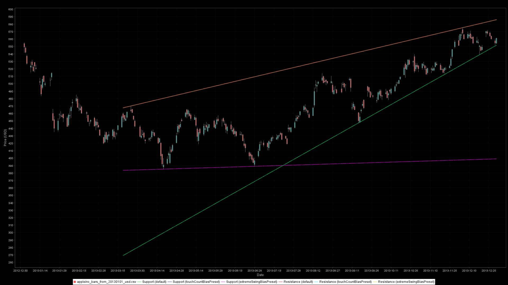
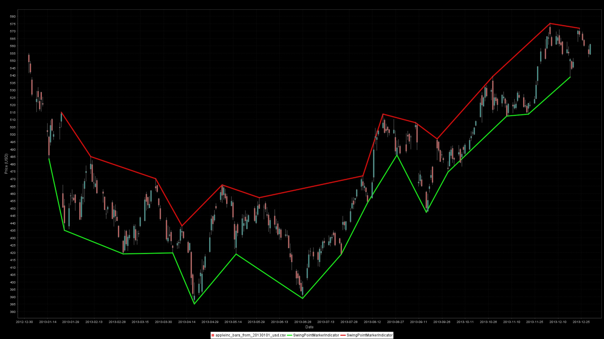

# Trendlines & Swing Points

Trendlines and swing points are the core building blocks behind support/resistance analysis, breakout systems, and Elliott-style structure detection. Ta4j ships a full toolkit for detecting swings, turning them into markers, and projecting data-driven support and resistance lines that behave the way traders draw them by hand.

## What you get
- **Fractal swing detectors**: window-based swing highs/lows with configurable symmetry and tolerance for flat tops/bottoms.
- **ZigZag swing detectors**: ATR/price-threshold reversals for adaptive swing confirmation without fixed lookahead windows.
- **Swing markers**: `SwingPointMarkerIndicator` converts swing indexes into chart-friendly markers (values only on swing bars, `NaN` elsewhere).
- **Trendlines**: `TrendLineSupportIndicator` / `TrendLineResistanceIndicator` that score every valid line in the lookback window and pick the best candidate with tunable weights and touch tolerance.
- **Chart-ready metadata**: `getSwingPointIndexes()` and `getCurrentSegment()` expose anchors, slope/intercept, and scoring so you can debug or annotate charts.

## Quick start: plot swings and lines

```java
BarSeries series = CsvBarSeriesDataSource.loadSeriesFromFile(); // daily AAPL sample

// 5–bar fractal swings (symmetric window, no equal lows/highs allowed)
LowPriceIndicator low = new LowPriceIndicator(series);
HighPriceIndicator high = new HighPriceIndicator(series);
RecentFractalSwingLowIndicator swingLows = new RecentFractalSwingLowIndicator(low, 5, 5, 0);
RecentFractalSwingHighIndicator swingHighs = new RecentFractalSwingHighIndicator(high, 5, 5, 0);

// Markers only where a swing is confirmed
SwingPointMarkerIndicator swingLowMarkers = new SwingPointMarkerIndicator(series, swingLows);
SwingPointMarkerIndicator swingHighMarkers = new SwingPointMarkerIndicator(series, swingHighs);

// Data-driven support/resistance lines over the last 200 bars
TrendLineSupportIndicator support = new TrendLineSupportIndicator(series, 5, 200);
TrendLineResistanceIndicator resistance = new TrendLineResistanceIndicator(series, 5, 200);

ChartWorkflow charts = new ChartWorkflow("temp/charts");
ChartPlan plan = charts.builder()
    .withTitle("Trendlines with fractal swing markers")
    .withSeries(series)
    .withIndicatorOverlay(support).withLineColor(Color.GREEN).withOpacity(0.6f)
    .withIndicatorOverlay(resistance).withLineColor(Color.RED).withOpacity(0.6f)
    .withIndicatorOverlay(swingLowMarkers).withLineColor(Color.GREEN).withLineWidth(3f).withConnectAcrossNaN(true)
    .withIndicatorOverlay(swingHighMarkers).withLineColor(Color.RED).withLineWidth(3f).withConnectAcrossNaN(true)
    .toPlan();
charts.display(plan);
```

## Swing point detectors

### Fractal swings (window-based)
`RecentFractalSwingHighIndicator` / `RecentFractalSwingLowIndicator` confirm a swing when the candidate bar beats its neighbors inside a symmetric or asymmetric window.

- `precedingHigherBars` / `precedingLowerBars`: how many bars immediately before must be strictly above/below the candidate. Must be ≥ 1 (default convenience constructor uses 3).
- `followingHigherBars` / `followingLowerBars`: how many bars after must be strictly above/below the candidate. Needs future bars, so swings confirm only after this window elapses.
- `allowedEqualBars`: how many bars on each side may equal the candidate value (helps catch rounded tops/bottoms instead of rejecting plateaus).
- Defaults: `new RecentFractalSwingLowIndicator(series)` → 3/3/0 on lows (highs mirror the parameters).

Use fractals when you want visually obvious turning points and don’t mind waiting a few bars for confirmation.

```java
// 7-bar symmetric window that tolerates one equal neighbor on each side
RecentFractalSwingHighIndicator majorHighs = new RecentFractalSwingHighIndicator(high, 7, 7, 1);
int latestHighIndex = majorHighs.getLatestSwingHighIndex(series.getEndIndex());
```

### ZigZag swings (reversal-threshold based)
`RecentZigZagSwingHighIndicator` / `RecentZigZagSwingLowIndicator` track swings confirmed when price reverses by at least a configured threshold—no fixed lookahead window.

- Driven by `ZigZagStateIndicator(price, reversalAmount)`.
- **Price indicator**: typically `HighPriceIndicator`, `LowPriceIndicator`, or `ClosePriceIndicator`.
- **Reversal threshold** (`reversalAmount`): indicator in price units. Defaults to `ATR(14)` in the convenience constructor; pass `ConstantIndicator` for fixed-point thresholds or any indicator for adaptive ones.
- Returns `NaN` until a reversal large enough to confirm the prior extreme.

```java
ClosePriceIndicator close = new ClosePriceIndicator(series);
// Confirm swings after a 1.5 * ATR move
ATRIndicator atr = new ATRIndicator(series, 14);
Indicator<Num> atrThreshold = BinaryOperationIndicator.product(atr, 1.5);
ZigZagStateIndicator zigzagState = new ZigZagStateIndicator(close, atrThreshold);

RecentZigZagSwingLowIndicator zigzagLows = new RecentZigZagSwingLowIndicator(zigzagState, close);
RecentZigZagSwingHighIndicator zigzagHighs = new RecentZigZagSwingHighIndicator(zigzagState, close);
```

### Showing swings on charts
`SwingPointMarkerIndicator` outputs prices only at swing indexes (`NaN` elsewhere) so chart overlays become discrete markers instead of lines.

```java
SwingPointMarkerIndicator swingLowMarkers = new SwingPointMarkerIndicator(series, swingLows);
SwingPointMarkerIndicator swingHighMarkers = new SwingPointMarkerIndicator(series, swingHighs);

chart.builder()
    .withSeries(series)
    .withIndicatorOverlay(swingLowMarkers).withLineColor(Color.GREEN).withLineWidth(3f).withConnectAcrossNaN(true)
    .withIndicatorOverlay(swingHighMarkers).withLineColor(Color.RED).withLineWidth(3f).withConnectAcrossNaN(true)
    .toPlan();
```

## Trendline indicators
`TrendLineSupportIndicator` and `TrendLineResistanceIndicator` project the “best” straight line across the last `barCount` bars using swing highs/lows as anchors. They:
- Recompute on every new bar, looking back `barCount` bars (use `Integer.MAX_VALUE` to span the full series; minimum is 2).
- Return `NaN` until at least two swings exist inside the window.
- Favor lines that connect many swings, include the extreme, avoid being violated, hug price, and use recent anchors.

### Core inputs
- **Swing source**: pass either a price indicator (internally creates a fractal swing detector) or any `RecentSwingIndicator` (e.g., ZigZag swings).
- **Swing window**: `barCount` caps how far back anchors can be chosen.
- **Symmetry helper**: overloads accept `surroundingHigherBars`/`surroundingLowerBars` for quick fractal setups.

```java
// Fractal-based support line over the last 300 bars, heavier bias to touching many swings
TrendLineSupportIndicator support = new TrendLineSupportIndicator(
    series,
    5,               // surrounding higher bars
    300,
    TrendLineSupportIndicator.ScoringWeights.touchCountBiasPreset()
);

// ZigZag-based resistance line using a custom swing detector
ZigZagStateIndicator zz = new ZigZagStateIndicator(high,
        new ConstantIndicator<>(series, series.numFactory().numOf(25)));
RecentZigZagSwingHighIndicator swingHighs = new RecentZigZagSwingHighIndicator(zz, high);
TrendLineResistanceIndicator resistance = new TrendLineResistanceIndicator(
    swingHighs,
    5, 5,            // preceding / following lower bars (kept for symmetry) 
    250
);
```

### Scoring weights (pick the “best” line)
Weights must sum to 1.0; defaults are **0.40 touch count / 0.15 extreme / 0.15 outside penalty / 0.15 proximity / 0.15 recency**.

```java
TrendLineSupportIndicator.ScoringWeights customWeights =
    TrendLineSupportIndicator.ScoringWeights.builder()
        .weightForTouchingSwingPoints(0.55)
        .weightForTouchingExtremeSwing(0.20)
        .weightForKeepingSwingsInsideLine(0.10)
        .weightForStayingCloseToSwings(0.10)
        .weightForRecentAnchorPoints(0.05)
        .build();

TrendLineSupportIndicator adaptiveSupport = new TrendLineSupportIndicator(series, 4, 180, customWeights);
```

Presets: `touchCountBiasPreset()` (connect as many swings as possible) and `extremeSwingBiasPreset()` (force the line through the extreme swing).

### Touch tolerance (what counts as “on the line”)
Tolerance is applied per swing to count a touch:

- `ToleranceSettings.percentage(fraction, minimumAbsolute)` (default 2% of swing range, min 1e-9).
- `ToleranceSettings.absolute(absolutePrice)`.
- `ToleranceSettings.tickSize(tickSize)` for fixed-increment markets.

```java
TrendLineResistanceIndicator tightResistance = new TrendLineResistanceIndicator(
    series,
    4,
    150,
    TrendLineResistanceIndicator.ScoringWeights.defaultWeights(),
    TrendLineResistanceIndicator.ToleranceSettings.absolute(0.25) // 25 cents wide
);
```

### Performance knobs & metadata
- **Search caps**: defaults limit the search to the most recent `64` swing points and `2048` candidate pairs. Increase for longer histories; decrease for very noisy intraday data.
- **Segment metadata**: `TrendLineSegment segment = support.getCurrentSegment();` exposes anchors, slope, intercept, touch/outside counts, score, and window start/end—great for logging or overlay labels.
- **Descriptor/JSON**: `support.toJson()` serializes parameters and the swing subtree for persistence.

## Strategy patterns

```java
ClosePriceIndicator close = new ClosePriceIndicator(series);
TrendLineResistanceIndicator resistance = new TrendLineResistanceIndicator(series, 5, 200);
TrendLineSupportIndicator support = new TrendLineSupportIndicator(series, 5, 200);

Rule breakoutLong = new CrossedUpIndicatorRule(close, resistance);
Rule bounceLong = new CrossedDownIndicatorRule(close, support)
        .and(new CrossedUpIndicatorRule(close, support));

Strategy trendlineStrategy = new BaseStrategy("Trendline break/bounce", breakoutLong, bounceLong.negation());
```

- **Breakouts**: `CrossedUpIndicatorRule(close, resistance)` / `CrossedDownIndicatorRule(close, support)`.
- **Bounces**: require price to tag support/resistance within tolerance, then reverse with momentum (e.g., RSI cross) to filter noise.
- **Structure filters**: combine fractal markers and ZigZag swings—e.g., require a higher low swing plus a rising support slope before buying breakouts.

## Visual examples


*Support/resistance lines from fractal swings. Default (red/green), touch-count bias (cyan/blue), and extreme-bias (orange/magenta) presets make different anchor choices.*


*ZigZag-based swings confirmed after ATR-sized reversals. Fewer, higher-conviction swings compared to fractals.*

## Best practices & pitfalls
- Swings need future bars: fractals confirm only after the `following*` window; ZigZag confirms after price moves by the threshold. Guard against `NaN` when rules fire.
- Align parameters with timeframe: wide windows on low-timeframe data will feel sluggish; on daily/weekly charts they remove noise.
- Keep price inputs consistent: if your ZigZag tracks highs/lows, feed the same price indicator into `RecentZigZagSwing*` and the trendline.
- Match lookback to data retention: if you set `series.setMaximumBarCount(250)`, keep trendline `barCount <= 250` or earlier anchors will be evicted.
- Tune tolerance to the instrument: use absolute/tick-size tolerance for low-priced or fixed-tick assets; percentage works well for equities.
- Watch performance with dense swing series: if you detect thousands of swings, lower `maxSwingPointsForTrendline` or raise the reversal/plateau thresholds to avoid combinatorial explosions.
